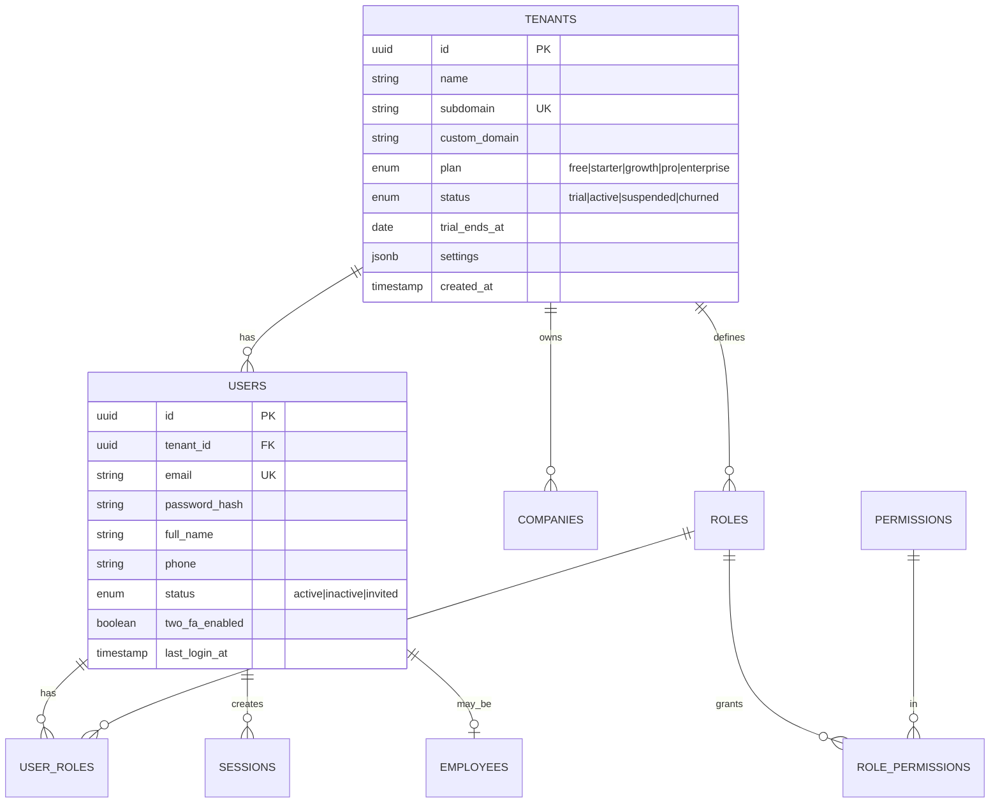
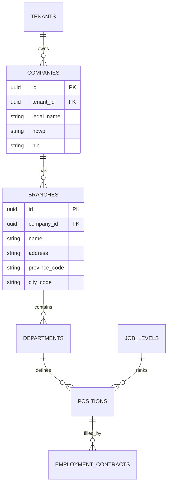
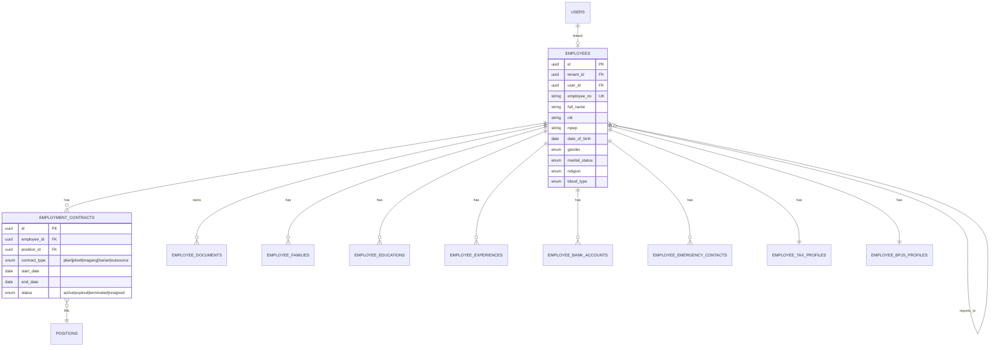
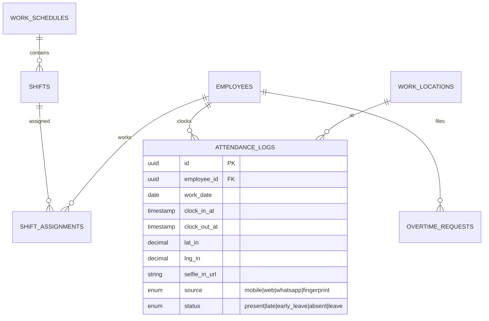
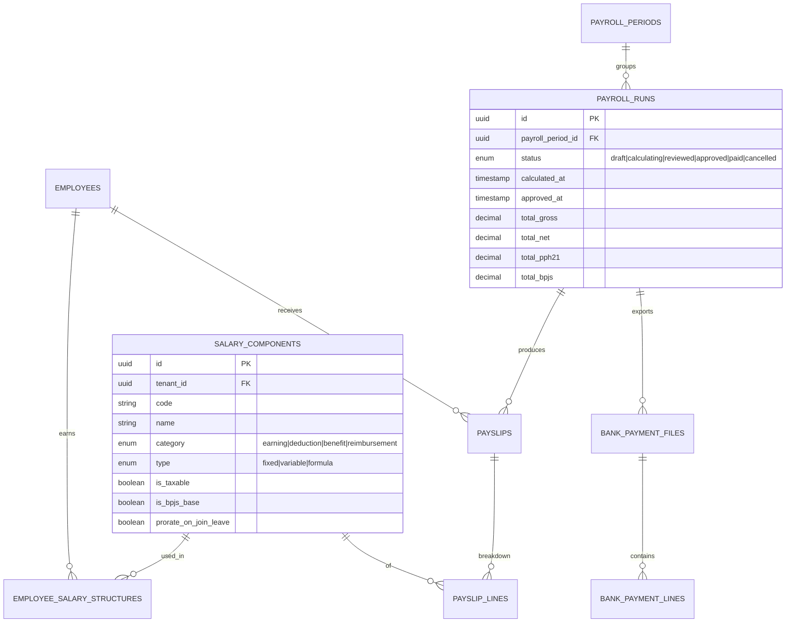
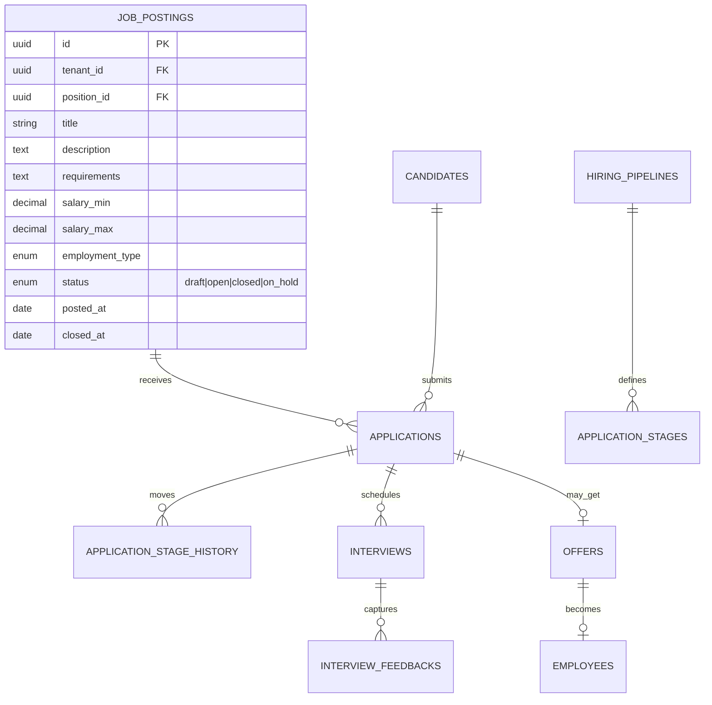
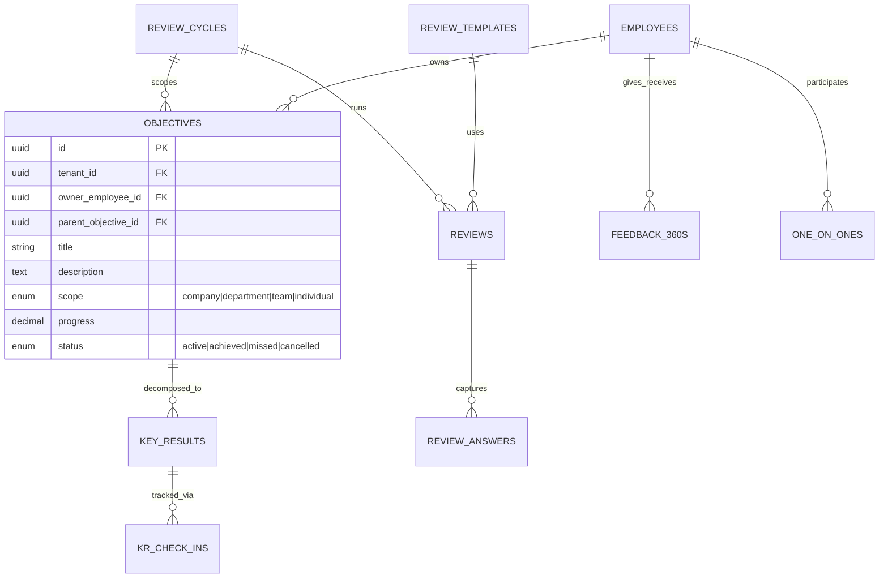
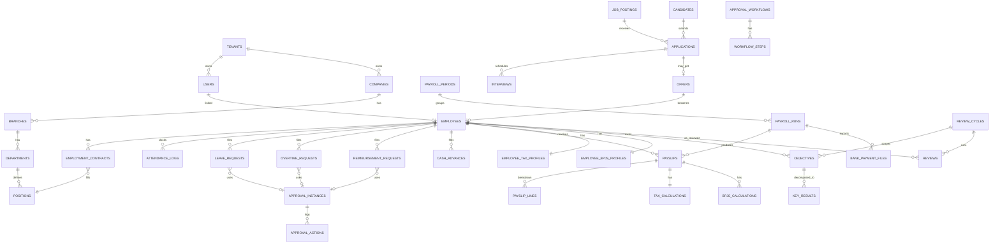

# ERD — Hirevo HRIS

**Status:** Draft v1.0
**Tanggal:** 2026-06-16
**Owner:** Edi Prasetiyo
**Database:** PostgreSQL 16 (multi-tenant hybrid: shared schema + Row-Level Security)

---

## 0. Konvensi & Prinsip Desain

### 0.1 Naming
- Tabel: `snake_case`, **plural** (`employees`, `payroll_runs`).
- PK: `id` (BIGSERIAL atau UUID v7 — *rekomendasi UUID v7 untuk multi-tenant + globally unique*).
- FK: `<table_singular>_id` (e.g. `employee_id`, `tenant_id`).
- Boolean: `is_*` / `has_*`.
- Timestamps: `created_at`, `updated_at`, `deleted_at` (soft delete).
- Money: `NUMERIC(18,2)` — JANGAN pakai FLOAT.
- Currency code: `CHAR(3)` ISO 4217, default `'IDR'`.

### 0.2 Multi-Tenancy
- **Setiap tabel bisnis WAJIB punya `tenant_id`** (kecuali tabel referensi global seperti `tax_brackets_ter`, `regions`, `banks`).
- **RLS aktif** di semua tabel ber-tenant_id:
  ```sql
  ALTER TABLE employees ENABLE ROW LEVEL SECURITY;
  CREATE POLICY tenant_isolation ON employees
    USING (tenant_id = current_setting('app.current_tenant_id')::uuid);
  ```
- Composite index: `(tenant_id, <kolom_query>)` untuk performa.
- Untuk Enterprise: opsi *dedicated schema* (`tenant_<id>.employees`) — same DDL, beda namespace.

### 0.3 Audit & Soft Delete
- Semua tabel transaksional punya `created_at`, `updated_at`, `created_by`, `updated_by`.
- Soft delete via `deleted_at` (nullable). Hard delete hanya untuk GDPR/PDP DSAR request.
- Tabel `audit_logs` mencatat semua perubahan kritis (employee data, payroll, salary).

### 0.4 Versioning
- Tabel referensi regulasi (PPh, BPJS) di-version dengan `effective_from`, `effective_to`.
- Tabel `employment_contracts` & `salary_structures` historis (tidak overwrite).

### 0.5 Partitioning (Enterprise scale)
- `attendance_logs` → partition by `RANGE(date_trunc('month', clock_in_at))`.
- `payslip_lines` → partition by `RANGE(period_year)`.
- `audit_logs` → partition by `RANGE(date_trunc('month', created_at))`.

---

## 1. Daftar Domain

| # | Domain | Tabel utama |
|---|--------|-------------|
| 1 | Tenancy & Auth | `tenants`, `users`, `roles`, `permissions`, `user_roles`, `sessions` |
| 2 | Organization | `companies`, `branches`, `departments`, `positions`, `job_levels` |
| 3 | Employee | `employees`, `employment_contracts`, `employee_documents`, `employee_families`, `employee_educations`, `employee_experiences`, `employee_bank_accounts` |
| 4 | Attendance | `work_schedules`, `shifts`, `shift_assignments`, `attendance_logs`, `work_locations`, `overtime_requests` |
| 5 | Leave | `leave_types`, `leave_policies`, `leave_balances`, `leave_requests`, `holidays` |
| 6 | Payroll | `salary_components`, `employee_salary_structures`, `payroll_periods`, `payroll_runs`, `payslips`, `payslip_lines`, `bank_payment_files`, `bank_payment_lines` |
| 7 | Tax (PPh 21) | `ptkp_statuses`, `tax_brackets_ter`, `tax_brackets_annual`, `employee_tax_profiles`, `tax_calculations`, `bukti_potong_1721a1` |
| 8 | BPJS | `bpjs_programs`, `bpjs_rates`, `employee_bpjs_profiles`, `bpjs_calculations`, `bpjs_export_files` |
| 9 | Reimbursement | `reimbursement_categories`, `reimbursement_requests`, `reimbursement_items`, `cash_advances`, `cash_advance_settlements` |
| 10 | Recruitment | `job_postings`, `candidates`, `applications`, `application_stages`, `interviews`, `interview_feedbacks`, `offers`, `hiring_pipelines` |
| 11 | Performance | `review_cycles`, `objectives`, `key_results`, `kr_check_ins`, `review_templates`, `reviews`, `review_answers`, `feedback_360s`, `one_on_ones` |
| 12 | Workflow | `approval_workflows`, `workflow_steps`, `approval_instances`, `approval_actions` |
| 13 | System | `notifications`, `audit_logs`, `documents`, `settings`, `webhook_events` |

---

## 2. Domain 1 — Tenancy & Auth

### 2.1 Mermaid



### 2.2 DDL

```sql
-- ============ TENANTS ============
CREATE TABLE tenants (
  id              UUID PRIMARY KEY DEFAULT gen_random_uuid(),
  name            VARCHAR(255) NOT NULL,
  subdomain       VARCHAR(63)  NOT NULL UNIQUE,
  custom_domain   VARCHAR(255) UNIQUE,
  plan            VARCHAR(20)  NOT NULL DEFAULT 'free'
                  CHECK (plan IN ('free','starter','growth','pro','enterprise')),
  status          VARCHAR(20)  NOT NULL DEFAULT 'trial'
                  CHECK (status IN ('trial','active','suspended','churned')),
  trial_ends_at   DATE,
  billing_email   VARCHAR(255),
  npwp            VARCHAR(25),
  address         TEXT,
  logo_url        TEXT,
  settings        JSONB        NOT NULL DEFAULT '{}',
  created_at      TIMESTAMPTZ  NOT NULL DEFAULT NOW(),
  updated_at      TIMESTAMPTZ  NOT NULL DEFAULT NOW(),
  deleted_at      TIMESTAMPTZ
);

-- ============ USERS ============
CREATE TABLE users (
  id              UUID PRIMARY KEY DEFAULT gen_random_uuid(),
  tenant_id       UUID NOT NULL REFERENCES tenants(id) ON DELETE CASCADE,
  email           VARCHAR(255) NOT NULL,
  password_hash   VARCHAR(255),
  full_name       VARCHAR(255) NOT NULL,
  phone           VARCHAR(20),
  avatar_url      TEXT,
  status          VARCHAR(20) NOT NULL DEFAULT 'invited'
                  CHECK (status IN ('active','inactive','invited','locked')),
  two_fa_enabled  BOOLEAN NOT NULL DEFAULT FALSE,
  two_fa_secret   VARCHAR(255),
  last_login_at   TIMESTAMPTZ,
  failed_logins   INT NOT NULL DEFAULT 0,
  created_at      TIMESTAMPTZ NOT NULL DEFAULT NOW(),
  updated_at      TIMESTAMPTZ NOT NULL DEFAULT NOW(),
  deleted_at      TIMESTAMPTZ,
  UNIQUE (tenant_id, email)
);
CREATE INDEX idx_users_tenant ON users(tenant_id) WHERE deleted_at IS NULL;

-- ============ ROLES & PERMISSIONS ============
CREATE TABLE roles (
  id              UUID PRIMARY KEY DEFAULT gen_random_uuid(),
  tenant_id       UUID REFERENCES tenants(id) ON DELETE CASCADE,  -- NULL = system role
  name            VARCHAR(50) NOT NULL,
  description     TEXT,
  is_system       BOOLEAN NOT NULL DEFAULT FALSE,
  created_at      TIMESTAMPTZ NOT NULL DEFAULT NOW(),
  UNIQUE (tenant_id, name)
);

CREATE TABLE permissions (
  id              SERIAL PRIMARY KEY,
  code            VARCHAR(100) NOT NULL UNIQUE,  -- e.g. 'payroll.run', 'employee.read'
  module          VARCHAR(50)  NOT NULL,
  description     TEXT
);

CREATE TABLE role_permissions (
  role_id         UUID NOT NULL REFERENCES roles(id) ON DELETE CASCADE,
  permission_id   INT  NOT NULL REFERENCES permissions(id) ON DELETE CASCADE,
  PRIMARY KEY (role_id, permission_id)
);

CREATE TABLE user_roles (
  user_id         UUID NOT NULL REFERENCES users(id) ON DELETE CASCADE,
  role_id         UUID NOT NULL REFERENCES roles(id) ON DELETE CASCADE,
  scope_branch_id UUID,  -- optional: role berlaku hanya di branch tertentu
  assigned_at     TIMESTAMPTZ NOT NULL DEFAULT NOW(),
  PRIMARY KEY (user_id, role_id, scope_branch_id)
);

-- ============ SESSIONS ============
CREATE TABLE sessions (
  id              UUID PRIMARY KEY DEFAULT gen_random_uuid(),
  user_id         UUID NOT NULL REFERENCES users(id) ON DELETE CASCADE,
  refresh_token   VARCHAR(255) NOT NULL UNIQUE,
  user_agent      TEXT,
  ip_address      INET,
  expires_at      TIMESTAMPTZ NOT NULL,
  revoked_at      TIMESTAMPTZ,
  created_at      TIMESTAMPTZ NOT NULL DEFAULT NOW()
);
CREATE INDEX idx_sessions_user ON sessions(user_id) WHERE revoked_at IS NULL;
```

---

## 3. Domain 2 — Organization Structure

### 3.1 Mermaid



### 3.2 DDL

```sql
CREATE TABLE companies (
  id              UUID PRIMARY KEY DEFAULT gen_random_uuid(),
  tenant_id       UUID NOT NULL REFERENCES tenants(id) ON DELETE CASCADE,
  legal_name      VARCHAR(255) NOT NULL,
  brand_name      VARCHAR(255),
  npwp            VARCHAR(25),
  nib             VARCHAR(25),
  industry        VARCHAR(100),
  established_at  DATE,
  address         TEXT,
  city_code       VARCHAR(10),
  province_code   VARCHAR(10),
  created_at      TIMESTAMPTZ NOT NULL DEFAULT NOW(),
  updated_at      TIMESTAMPTZ NOT NULL DEFAULT NOW(),
  deleted_at      TIMESTAMPTZ
);

CREATE TABLE branches (
  id              UUID PRIMARY KEY DEFAULT gen_random_uuid(),
  tenant_id       UUID NOT NULL REFERENCES tenants(id) ON DELETE CASCADE,
  company_id      UUID NOT NULL REFERENCES companies(id) ON DELETE CASCADE,
  code            VARCHAR(20),
  name            VARCHAR(255) NOT NULL,
  address         TEXT,
  city_code       VARCHAR(10),
  province_code   VARCHAR(10),
  is_head_office  BOOLEAN NOT NULL DEFAULT FALSE,
  created_at      TIMESTAMPTZ NOT NULL DEFAULT NOW(),
  updated_at      TIMESTAMPTZ NOT NULL DEFAULT NOW(),
  deleted_at      TIMESTAMPTZ,
  UNIQUE (company_id, code)
);

CREATE TABLE departments (
  id              UUID PRIMARY KEY DEFAULT gen_random_uuid(),
  tenant_id       UUID NOT NULL REFERENCES tenants(id) ON DELETE CASCADE,
  branch_id       UUID REFERENCES branches(id),
  parent_id       UUID REFERENCES departments(id),
  code            VARCHAR(20),
  name            VARCHAR(255) NOT NULL,
  head_employee_id UUID,  -- FK ke employees, dipasang setelah employees ada
  created_at      TIMESTAMPTZ NOT NULL DEFAULT NOW(),
  updated_at      TIMESTAMPTZ NOT NULL DEFAULT NOW(),
  deleted_at      TIMESTAMPTZ
);

CREATE TABLE job_levels (
  id              UUID PRIMARY KEY DEFAULT gen_random_uuid(),
  tenant_id       UUID NOT NULL REFERENCES tenants(id) ON DELETE CASCADE,
  code            VARCHAR(20),
  name            VARCHAR(100) NOT NULL,  -- e.g. 'Staff','Senior','Manager','Director'
  rank            INT NOT NULL,           -- urutan hierarki
  min_salary      NUMERIC(18,2),
  max_salary      NUMERIC(18,2),
  UNIQUE (tenant_id, code)
);

CREATE TABLE positions (
  id              UUID PRIMARY KEY DEFAULT gen_random_uuid(),
  tenant_id       UUID NOT NULL REFERENCES tenants(id) ON DELETE CASCADE,
  department_id   UUID REFERENCES departments(id),
  job_level_id    UUID REFERENCES job_levels(id),
  code            VARCHAR(20),
  name            VARCHAR(255) NOT NULL,
  description     TEXT,
  is_active       BOOLEAN NOT NULL DEFAULT TRUE,
  created_at      TIMESTAMPTZ NOT NULL DEFAULT NOW(),
  updated_at      TIMESTAMPTZ NOT NULL DEFAULT NOW()
);
CREATE INDEX idx_positions_tenant_dept ON positions(tenant_id, department_id);
```

---

## 4. Domain 3 — Employee Data

### 4.1 Mermaid



### 4.2 DDL

```sql
CREATE TABLE employees (
  id                 UUID PRIMARY KEY DEFAULT gen_random_uuid(),
  tenant_id          UUID NOT NULL REFERENCES tenants(id) ON DELETE CASCADE,
  user_id            UUID UNIQUE REFERENCES users(id) ON DELETE SET NULL,
  employee_no        VARCHAR(50) NOT NULL,
  full_name          VARCHAR(255) NOT NULL,
  nickname           VARCHAR(100),
  nik                VARCHAR(20),                -- KTP, encrypted at-rest
  npwp               VARCHAR(25),                -- encrypted
  passport_no        VARCHAR(25),
  date_of_birth      DATE,
  place_of_birth     VARCHAR(100),
  gender             VARCHAR(10) CHECK (gender IN ('male','female')),
  marital_status     VARCHAR(20) CHECK (marital_status IN ('single','married','divorced','widowed')),
  religion           VARCHAR(20),
  blood_type         VARCHAR(3),
  nationality        VARCHAR(50) DEFAULT 'Indonesia',
  personal_email     VARCHAR(255),
  phone              VARCHAR(20),
  whatsapp           VARCHAR(20),
  address            TEXT,
  city_code          VARCHAR(10),
  province_code      VARCHAR(10),
  postal_code        VARCHAR(10),
  photo_url          TEXT,
  manager_id         UUID REFERENCES employees(id),
  hire_date          DATE NOT NULL,
  resign_date        DATE,
  resign_reason      TEXT,
  status             VARCHAR(20) NOT NULL DEFAULT 'active'
                     CHECK (status IN ('active','probation','resigned','terminated','retired')),
  created_at         TIMESTAMPTZ NOT NULL DEFAULT NOW(),
  updated_at         TIMESTAMPTZ NOT NULL DEFAULT NOW(),
  deleted_at         TIMESTAMPTZ,
  UNIQUE (tenant_id, employee_no)
);
CREATE INDEX idx_employees_tenant_status ON employees(tenant_id, status) WHERE deleted_at IS NULL;
CREATE INDEX idx_employees_manager ON employees(manager_id);

CREATE TABLE employment_contracts (
  id              UUID PRIMARY KEY DEFAULT gen_random_uuid(),
  tenant_id       UUID NOT NULL REFERENCES tenants(id) ON DELETE CASCADE,
  employee_id     UUID NOT NULL REFERENCES employees(id) ON DELETE CASCADE,
  company_id      UUID NOT NULL REFERENCES companies(id),
  branch_id       UUID REFERENCES branches(id),
  position_id     UUID REFERENCES positions(id),
  contract_no     VARCHAR(50),
  contract_type   VARCHAR(20) NOT NULL
                  CHECK (contract_type IN ('pkwt','pkwtt','magang','harian_lepas','outsource','part_time')),
  start_date      DATE NOT NULL,
  end_date        DATE,                       -- NULL untuk PKWTT
  probation_until DATE,
  base_salary     NUMERIC(18,2) NOT NULL,
  work_arrangement VARCHAR(20)                -- 'onsite','remote','hybrid'
                   CHECK (work_arrangement IN ('onsite','remote','hybrid')),
  status          VARCHAR(20) NOT NULL DEFAULT 'active'
                  CHECK (status IN ('active','expired','terminated','renewed')),
  document_url    TEXT,
  created_at      TIMESTAMPTZ NOT NULL DEFAULT NOW(),
  updated_at      TIMESTAMPTZ NOT NULL DEFAULT NOW()
);
CREATE INDEX idx_contracts_employee_status ON employment_contracts(employee_id, status);

CREATE TABLE employee_families (
  id              UUID PRIMARY KEY DEFAULT gen_random_uuid(),
  tenant_id       UUID NOT NULL REFERENCES tenants(id) ON DELETE CASCADE,
  employee_id     UUID NOT NULL REFERENCES employees(id) ON DELETE CASCADE,
  relationship    VARCHAR(20) NOT NULL
                  CHECK (relationship IN ('spouse','child','parent','sibling')),
  full_name       VARCHAR(255) NOT NULL,
  nik             VARCHAR(20),
  date_of_birth   DATE,
  is_dependent    BOOLEAN NOT NULL DEFAULT FALSE,   -- penting untuk PTKP
  is_bpjs_covered BOOLEAN NOT NULL DEFAULT FALSE,
  created_at      TIMESTAMPTZ NOT NULL DEFAULT NOW()
);

CREATE TABLE employee_educations (
  id              UUID PRIMARY KEY DEFAULT gen_random_uuid(),
  tenant_id       UUID NOT NULL REFERENCES tenants(id) ON DELETE CASCADE,
  employee_id     UUID NOT NULL REFERENCES employees(id) ON DELETE CASCADE,
  level           VARCHAR(20),                -- 'SMA','D3','S1','S2','S3'
  institution     VARCHAR(255),
  major           VARCHAR(255),
  start_year      INT,
  end_year        INT,
  gpa             NUMERIC(3,2),
  certificate_url TEXT
);

CREATE TABLE employee_experiences (
  id              UUID PRIMARY KEY DEFAULT gen_random_uuid(),
  tenant_id       UUID NOT NULL REFERENCES tenants(id) ON DELETE CASCADE,
  employee_id     UUID NOT NULL REFERENCES employees(id) ON DELETE CASCADE,
  company_name    VARCHAR(255),
  position        VARCHAR(255),
  start_date      DATE,
  end_date        DATE,
  description     TEXT
);

CREATE TABLE employee_bank_accounts (
  id              UUID PRIMARY KEY DEFAULT gen_random_uuid(),
  tenant_id       UUID NOT NULL REFERENCES tenants(id) ON DELETE CASCADE,
  employee_id     UUID NOT NULL REFERENCES employees(id) ON DELETE CASCADE,
  bank_code       VARCHAR(10) NOT NULL,       -- ref ke tabel banks (global)
  account_number  VARCHAR(50) NOT NULL,        -- encrypted
  account_holder  VARCHAR(255) NOT NULL,
  is_primary      BOOLEAN NOT NULL DEFAULT TRUE,
  purpose         VARCHAR(20) DEFAULT 'payroll'
                  CHECK (purpose IN ('payroll','reimbursement','other'))
);

CREATE TABLE employee_emergency_contacts (
  id              UUID PRIMARY KEY DEFAULT gen_random_uuid(),
  tenant_id       UUID NOT NULL,
  employee_id     UUID NOT NULL REFERENCES employees(id) ON DELETE CASCADE,
  full_name       VARCHAR(255) NOT NULL,
  relationship    VARCHAR(50),
  phone           VARCHAR(20) NOT NULL,
  address         TEXT
);

CREATE TABLE employee_documents (
  id              UUID PRIMARY KEY DEFAULT gen_random_uuid(),
  tenant_id       UUID NOT NULL,
  employee_id     UUID NOT NULL REFERENCES employees(id) ON DELETE CASCADE,
  document_type   VARCHAR(50),                 -- 'ktp','npwp','ijazah','contract','sk'
  file_url        TEXT NOT NULL,
  file_size_kb    INT,
  mime_type       VARCHAR(50),
  expires_at      DATE,                        -- untuk KIMS/Passport
  uploaded_by     UUID REFERENCES users(id),
  uploaded_at     TIMESTAMPTZ NOT NULL DEFAULT NOW()
);
```

---

## 5. Domain 4 — Attendance

### 5.1 Mermaid



### 5.2 DDL

```sql
CREATE TABLE work_locations (
  id              UUID PRIMARY KEY DEFAULT gen_random_uuid(),
  tenant_id       UUID NOT NULL REFERENCES tenants(id) ON DELETE CASCADE,
  branch_id       UUID REFERENCES branches(id),
  name            VARCHAR(255) NOT NULL,
  address         TEXT,
  latitude        NUMERIC(10,7) NOT NULL,
  longitude       NUMERIC(10,7) NOT NULL,
  radius_meters   INT NOT NULL DEFAULT 100,
  is_active       BOOLEAN NOT NULL DEFAULT TRUE
);

CREATE TABLE work_schedules (
  id              UUID PRIMARY KEY DEFAULT gen_random_uuid(),
  tenant_id       UUID NOT NULL,
  name            VARCHAR(100) NOT NULL,      -- 'Office 9-5','Shift Pabrik 3-shift'
  description     TEXT,
  is_active       BOOLEAN NOT NULL DEFAULT TRUE
);

CREATE TABLE shifts (
  id              UUID PRIMARY KEY DEFAULT gen_random_uuid(),
  tenant_id       UUID NOT NULL,
  work_schedule_id UUID NOT NULL REFERENCES work_schedules(id) ON DELETE CASCADE,
  name            VARCHAR(50) NOT NULL,       -- 'Pagi','Siang','Malam'
  start_time      TIME NOT NULL,
  end_time        TIME NOT NULL,
  break_minutes   INT NOT NULL DEFAULT 60,
  is_night_shift  BOOLEAN NOT NULL DEFAULT FALSE,
  late_tolerance_minutes INT NOT NULL DEFAULT 15,
  color_hex       VARCHAR(7)
);

CREATE TABLE shift_assignments (
  id              UUID PRIMARY KEY DEFAULT gen_random_uuid(),
  tenant_id       UUID NOT NULL,
  employee_id     UUID NOT NULL REFERENCES employees(id) ON DELETE CASCADE,
  shift_id        UUID NOT NULL REFERENCES shifts(id),
  work_date       DATE NOT NULL,
  is_day_off      BOOLEAN NOT NULL DEFAULT FALSE,
  created_at      TIMESTAMPTZ NOT NULL DEFAULT NOW(),
  UNIQUE (employee_id, work_date)
);
CREATE INDEX idx_shift_assign_date ON shift_assignments(tenant_id, work_date);

CREATE TABLE attendance_logs (
  id              UUID PRIMARY KEY DEFAULT gen_random_uuid(),
  tenant_id       UUID NOT NULL,
  employee_id     UUID NOT NULL REFERENCES employees(id) ON DELETE CASCADE,
  shift_id        UUID REFERENCES shifts(id),
  work_location_id UUID REFERENCES work_locations(id),
  work_date       DATE NOT NULL,
  clock_in_at     TIMESTAMPTZ,
  clock_out_at    TIMESTAMPTZ,
  lat_in          NUMERIC(10,7),
  lng_in          NUMERIC(10,7),
  lat_out         NUMERIC(10,7),
  lng_out         NUMERIC(10,7),
  selfie_in_url   TEXT,
  selfie_out_url  TEXT,
  source_in       VARCHAR(20) CHECK (source_in IN ('mobile','web','whatsapp','fingerprint','manual')),
  source_out      VARCHAR(20) CHECK (source_out IN ('mobile','web','whatsapp','fingerprint','manual')),
  notes_in        TEXT,
  notes_out       TEXT,
  late_minutes    INT DEFAULT 0,
  early_leave_minutes INT DEFAULT 0,
  worked_minutes  INT,
  status          VARCHAR(20) NOT NULL DEFAULT 'present'
                  CHECK (status IN ('present','late','early_leave','absent','leave','holiday','wfh','sick','permit')),
  is_anomaly      BOOLEAN NOT NULL DEFAULT FALSE,   -- mock GPS, foto blur, dll
  anomaly_reason  TEXT,
  created_at      TIMESTAMPTZ NOT NULL DEFAULT NOW(),
  updated_at      TIMESTAMPTZ NOT NULL DEFAULT NOW()
) PARTITION BY RANGE (work_date);

-- Contoh partition bulanan
CREATE TABLE attendance_logs_2026_07 PARTITION OF attendance_logs
  FOR VALUES FROM ('2026-07-01') TO ('2026-08-01');

CREATE INDEX idx_attendance_emp_date ON attendance_logs(tenant_id, employee_id, work_date);

CREATE TABLE overtime_requests (
  id              UUID PRIMARY KEY DEFAULT gen_random_uuid(),
  tenant_id       UUID NOT NULL,
  employee_id     UUID NOT NULL REFERENCES employees(id) ON DELETE CASCADE,
  work_date       DATE NOT NULL,
  start_time      TIMESTAMPTZ NOT NULL,
  end_time        TIMESTAMPTZ NOT NULL,
  duration_minutes INT NOT NULL,
  reason          TEXT,
  status          VARCHAR(20) NOT NULL DEFAULT 'pending'
                  CHECK (status IN ('pending','approved','rejected','cancelled')),
  approval_instance_id UUID,                   -- ref ke approval_instances
  -- Hasil kalkulasi (di-set saat approved)
  is_holiday      BOOLEAN DEFAULT FALSE,
  calculated_amount NUMERIC(18,2),             -- sesuai PP 35/2021
  rate_used       JSONB,                       -- snapshot rumus: {hour1:1.5, hour2:2, ...}
  created_at      TIMESTAMPTZ NOT NULL DEFAULT NOW(),
  updated_at      TIMESTAMPTZ NOT NULL DEFAULT NOW()
);
```

---

## 6. Domain 5 — Leave Management

### 6.1 DDL

```sql
CREATE TABLE leave_types (
  id                  UUID PRIMARY KEY DEFAULT gen_random_uuid(),
  tenant_id           UUID NOT NULL REFERENCES tenants(id) ON DELETE CASCADE,
  code                VARCHAR(20) NOT NULL,    -- 'annual','sick','maternity','marriage','bereavement'
  name                VARCHAR(100) NOT NULL,
  is_paid             BOOLEAN NOT NULL DEFAULT TRUE,
  default_days_per_year NUMERIC(5,2),         -- 12 untuk cuti tahunan
  carry_over_max_days NUMERIC(5,2),
  carry_over_expire_months INT,
  require_attachment  BOOLEAN NOT NULL DEFAULT FALSE,
  min_notice_days     INT DEFAULT 0,
  max_consecutive_days INT,
  is_system           BOOLEAN NOT NULL DEFAULT FALSE,  -- preset UU
  is_active           BOOLEAN NOT NULL DEFAULT TRUE,
  UNIQUE (tenant_id, code)
);

CREATE TABLE leave_balances (
  id              UUID PRIMARY KEY DEFAULT gen_random_uuid(),
  tenant_id       UUID NOT NULL,
  employee_id     UUID NOT NULL REFERENCES employees(id) ON DELETE CASCADE,
  leave_type_id   UUID NOT NULL REFERENCES leave_types(id),
  year            INT NOT NULL,
  initial_balance NUMERIC(5,2) NOT NULL,       -- alokasi tahun ini
  carry_over      NUMERIC(5,2) NOT NULL DEFAULT 0,
  used            NUMERIC(5,2) NOT NULL DEFAULT 0,
  pending         NUMERIC(5,2) NOT NULL DEFAULT 0,
  remaining       NUMERIC(5,2) GENERATED ALWAYS AS
                  (initial_balance + carry_over - used - pending) STORED,
  UNIQUE (employee_id, leave_type_id, year)
);

CREATE TABLE leave_requests (
  id              UUID PRIMARY KEY DEFAULT gen_random_uuid(),
  tenant_id       UUID NOT NULL,
  employee_id     UUID NOT NULL REFERENCES employees(id) ON DELETE CASCADE,
  leave_type_id   UUID NOT NULL REFERENCES leave_types(id),
  start_date      DATE NOT NULL,
  end_date        DATE NOT NULL,
  total_days      NUMERIC(5,2) NOT NULL,        -- exclude weekend & holiday
  reason          TEXT,
  attachment_url  TEXT,
  status          VARCHAR(20) NOT NULL DEFAULT 'pending'
                  CHECK (status IN ('pending','approved','rejected','cancelled')),
  approval_instance_id UUID,
  approved_at     TIMESTAMPTZ,
  cancelled_at    TIMESTAMPTZ,
  created_at      TIMESTAMPTZ NOT NULL DEFAULT NOW(),
  updated_at      TIMESTAMPTZ NOT NULL DEFAULT NOW()
);
CREATE INDEX idx_leave_emp_date ON leave_requests(tenant_id, employee_id, start_date);

CREATE TABLE holidays (
  id              UUID PRIMARY KEY DEFAULT gen_random_uuid(),
  tenant_id       UUID REFERENCES tenants(id) ON DELETE CASCADE,  -- NULL = nasional
  holiday_date    DATE NOT NULL,
  name            VARCHAR(255) NOT NULL,
  is_national     BOOLEAN NOT NULL DEFAULT TRUE,
  is_joint_leave  BOOLEAN NOT NULL DEFAULT FALSE,    -- cuti bersama
  UNIQUE (tenant_id, holiday_date, name)
);
```

---

## 7. Domain 6 — Payroll

### 7.1 Mermaid



### 7.2 DDL

```sql
-- ============ SALARY COMPONENTS ============
CREATE TABLE salary_components (
  id              UUID PRIMARY KEY DEFAULT gen_random_uuid(),
  tenant_id       UUID NOT NULL REFERENCES tenants(id) ON DELETE CASCADE,
  code            VARCHAR(50) NOT NULL,
  name            VARCHAR(255) NOT NULL,
  category        VARCHAR(20) NOT NULL
                  CHECK (category IN ('earning','deduction','benefit','reimbursement','employer_contribution')),
  type            VARCHAR(20) NOT NULL
                  CHECK (type IN ('fixed','variable','formula','attendance_based')),
  formula         TEXT,                          -- expression engine (Mozart-like / JSONLogic)
  default_amount  NUMERIC(18,2),
  is_taxable      BOOLEAN NOT NULL DEFAULT TRUE,
  is_bpjs_kes_base BOOLEAN NOT NULL DEFAULT FALSE,
  is_bpjs_tk_base  BOOLEAN NOT NULL DEFAULT FALSE,
  prorate_on_join_leave BOOLEAN NOT NULL DEFAULT TRUE,
  prorate_method  VARCHAR(20) DEFAULT 'calendar_days'
                  CHECK (prorate_method IN ('calendar_days','working_days','none')),
  gl_account_code VARCHAR(50),                   -- untuk integrasi accounting
  display_order   INT DEFAULT 0,
  is_active       BOOLEAN NOT NULL DEFAULT TRUE,
  UNIQUE (tenant_id, code)
);

-- ============ EMPLOYEE SALARY STRUCTURE (histori) ============
CREATE TABLE employee_salary_structures (
  id              UUID PRIMARY KEY DEFAULT gen_random_uuid(),
  tenant_id       UUID NOT NULL,
  employee_id     UUID NOT NULL REFERENCES employees(id) ON DELETE CASCADE,
  salary_component_id UUID NOT NULL REFERENCES salary_components(id),
  amount          NUMERIC(18,2) NOT NULL,
  effective_from  DATE NOT NULL,
  effective_to    DATE,                          -- NULL = current
  reason          VARCHAR(255),                  -- 'promotion','annual_adjustment','demotion'
  approved_by     UUID REFERENCES users(id),
  created_at      TIMESTAMPTZ NOT NULL DEFAULT NOW()
);
CREATE INDEX idx_salary_struct_emp ON employee_salary_structures(employee_id, effective_from);

-- ============ PAYROLL PERIOD & RUN ============
CREATE TABLE payroll_periods (
  id              UUID PRIMARY KEY DEFAULT gen_random_uuid(),
  tenant_id       UUID NOT NULL REFERENCES tenants(id) ON DELETE CASCADE,
  name            VARCHAR(100) NOT NULL,         -- 'Juli 2026'
  period_year     INT NOT NULL,
  period_month    INT NOT NULL,
  start_date      DATE NOT NULL,
  end_date        DATE NOT NULL,
  cutoff_date     DATE NOT NULL,                 -- batas akhir absen masuk
  pay_date        DATE NOT NULL,
  type            VARCHAR(20) NOT NULL DEFAULT 'monthly'
                  CHECK (type IN ('monthly','thr','bonus','adjustment')),
  status          VARCHAR(20) NOT NULL DEFAULT 'open'
                  CHECK (status IN ('open','closed','reopened')),
  UNIQUE (tenant_id, period_year, period_month, type)
);

CREATE TABLE payroll_runs (
  id                  UUID PRIMARY KEY DEFAULT gen_random_uuid(),
  tenant_id           UUID NOT NULL,
  payroll_period_id   UUID NOT NULL REFERENCES payroll_periods(id),
  company_id          UUID NOT NULL REFERENCES companies(id),
  branch_id           UUID REFERENCES branches(id),    -- NULL = all
  run_no              VARCHAR(50),
  status              VARCHAR(20) NOT NULL DEFAULT 'draft'
                      CHECK (status IN ('draft','calculating','calculated','reviewed','approved','paid','cancelled','failed')),
  total_employees     INT,
  total_gross         NUMERIC(18,2),
  total_deductions    NUMERIC(18,2),
  total_pph21         NUMERIC(18,2),
  total_bpjs_employee NUMERIC(18,2),
  total_bpjs_employer NUMERIC(18,2),
  total_net           NUMERIC(18,2),
  calculated_at       TIMESTAMPTZ,
  reviewed_by         UUID REFERENCES users(id),
  reviewed_at         TIMESTAMPTZ,
  approved_by         UUID REFERENCES users(id),
  approved_at         TIMESTAMPTZ,
  paid_at             TIMESTAMPTZ,
  rule_pack_version   VARCHAR(20) NOT NULL,            -- versi engine yang dipakai
  notes               TEXT,
  created_at          TIMESTAMPTZ NOT NULL DEFAULT NOW(),
  updated_at          TIMESTAMPTZ NOT NULL DEFAULT NOW()
);

-- ============ PAYSLIP ============
CREATE TABLE payslips (
  id                  UUID PRIMARY KEY DEFAULT gen_random_uuid(),
  tenant_id           UUID NOT NULL,
  payroll_run_id      UUID NOT NULL REFERENCES payroll_runs(id) ON DELETE CASCADE,
  employee_id         UUID NOT NULL REFERENCES employees(id),
  employment_contract_id UUID REFERENCES employment_contracts(id),
  -- working days
  working_days        INT,
  present_days        INT,
  absent_days         INT,
  leave_days          NUMERIC(5,2),
  late_count          INT,
  overtime_hours      NUMERIC(6,2),
  -- amounts
  gross_amount        NUMERIC(18,2) NOT NULL,
  taxable_amount      NUMERIC(18,2) NOT NULL,
  pph21_amount        NUMERIC(18,2) NOT NULL DEFAULT 0,
  bpjs_employee       NUMERIC(18,2) NOT NULL DEFAULT 0,
  bpjs_employer       NUMERIC(18,2) NOT NULL DEFAULT 0,
  other_deductions    NUMERIC(18,2) NOT NULL DEFAULT 0,
  net_amount          NUMERIC(18,2) NOT NULL,
  -- payment
  payment_method      VARCHAR(20) DEFAULT 'bank_transfer',
  bank_code           VARCHAR(10),
  bank_account_no     VARCHAR(50),
  -- meta
  payslip_pdf_url     TEXT,
  is_sent             BOOLEAN NOT NULL DEFAULT FALSE,
  sent_at             TIMESTAMPTZ,
  -- snapshot of tax profile saat run
  ptkp_code           VARCHAR(10),
  ter_category        VARCHAR(5),                     -- A, B, C
  calculation_snapshot JSONB,                          -- input lengkap untuk audit
  created_at          TIMESTAMPTZ NOT NULL DEFAULT NOW(),
  UNIQUE (payroll_run_id, employee_id)
);

CREATE TABLE payslip_lines (
  id                  UUID PRIMARY KEY DEFAULT gen_random_uuid(),
  tenant_id           UUID NOT NULL,
  payslip_id          UUID NOT NULL REFERENCES payslips(id) ON DELETE CASCADE,
  salary_component_id UUID NOT NULL REFERENCES salary_components(id),
  category            VARCHAR(20) NOT NULL,            -- denormalized untuk speed
  amount              NUMERIC(18,2) NOT NULL,
  quantity            NUMERIC(10,2),                   -- e.g. jumlah jam lembur
  rate                NUMERIC(18,2),
  notes               TEXT,
  display_order       INT
) PARTITION BY RANGE (created_at);

-- ============ BANK PAYMENT FILE ============
CREATE TABLE bank_payment_files (
  id              UUID PRIMARY KEY DEFAULT gen_random_uuid(),
  tenant_id       UUID NOT NULL,
  payroll_run_id  UUID NOT NULL REFERENCES payroll_runs(id) ON DELETE CASCADE,
  bank_code       VARCHAR(10) NOT NULL,             -- BCA, MANDIRI, BRI, BNI, CIMB
  format          VARCHAR(20) NOT NULL,             -- 'csv','txt','xlsx','xml'
  file_url        TEXT,
  total_amount    NUMERIC(18,2) NOT NULL,
  total_records   INT NOT NULL,
  generated_at    TIMESTAMPTZ NOT NULL DEFAULT NOW(),
  generated_by    UUID REFERENCES users(id)
);

CREATE TABLE bank_payment_lines (
  id              UUID PRIMARY KEY DEFAULT gen_random_uuid(),
  bank_payment_file_id UUID NOT NULL REFERENCES bank_payment_files(id) ON DELETE CASCADE,
  employee_id     UUID NOT NULL REFERENCES employees(id),
  payslip_id      UUID NOT NULL REFERENCES payslips(id),
  bank_account_no VARCHAR(50) NOT NULL,
  amount          NUMERIC(18,2) NOT NULL,
  description     VARCHAR(100)
);
```

---

## 8. Domain 7 — Tax / PPh 21

### 8.1 Catatan PPh 21 TER (Tarif Efektif Rata-rata, PMK 168/2023)
- Per Jan 2024, perhitungan bulanan pakai TER (kategori A/B/C berdasarkan PTKP), bulan Desember pakai tarif progresif tahunan untuk koreksi.
- Kategori TER:
  - **A**: TK/0, TK/1, K/0
  - **B**: TK/2, TK/3, K/1, K/2
  - **C**: K/3

### 8.2 DDL

```sql
-- ============ PTKP & TER (global reference) ============
CREATE TABLE ptkp_statuses (
  id              SERIAL PRIMARY KEY,
  code            VARCHAR(10) NOT NULL UNIQUE,      -- 'TK/0','K/0','K/3', etc.
  description     VARCHAR(100),
  annual_amount   NUMERIC(18,2) NOT NULL,           -- e.g. 54.000.000 untuk TK/0
  ter_category    CHAR(1) NOT NULL CHECK (ter_category IN ('A','B','C')),
  effective_from  DATE NOT NULL,
  effective_to    DATE
);

-- Tarif TER bulanan (per kategori, per bracket penghasilan bruto bulanan)
CREATE TABLE tax_brackets_ter (
  id              SERIAL PRIMARY KEY,
  ter_category    CHAR(1) NOT NULL CHECK (ter_category IN ('A','B','C')),
  bracket_from    NUMERIC(18,2) NOT NULL,
  bracket_to      NUMERIC(18,2),                    -- NULL = unlimited
  rate_percent    NUMERIC(5,4) NOT NULL,            -- 0.0050 = 0.5%
  effective_from  DATE NOT NULL,
  effective_to    DATE
);

-- Tarif progresif tahunan (untuk Desember & karyawan keluar)
CREATE TABLE tax_brackets_annual (
  id              SERIAL PRIMARY KEY,
  bracket_from    NUMERIC(18,2) NOT NULL,
  bracket_to      NUMERIC(18,2),
  rate_percent    NUMERIC(5,4) NOT NULL,            -- 0.05, 0.15, 0.25, 0.30, 0.35
  effective_from  DATE NOT NULL,
  effective_to    DATE
);

-- ============ EMPLOYEE TAX PROFILE ============
CREATE TABLE employee_tax_profiles (
  id                  UUID PRIMARY KEY DEFAULT gen_random_uuid(),
  tenant_id           UUID NOT NULL,
  employee_id         UUID NOT NULL UNIQUE REFERENCES employees(id) ON DELETE CASCADE,
  ptkp_code           VARCHAR(10) NOT NULL,            -- snapshot terkini
  npwp                VARCHAR(25),
  has_npwp            BOOLEAN NOT NULL DEFAULT TRUE,   -- non-NPWP = +20% tarif (sebelum 2024)
  tax_method          VARCHAR(20) NOT NULL DEFAULT 'gross'
                      CHECK (tax_method IN ('gross','gross_up','net')),
  is_expatriate       BOOLEAN NOT NULL DEFAULT FALSE,
  tax_office_code     VARCHAR(10),                     -- KPP
  effective_from      DATE NOT NULL,
  created_at          TIMESTAMPTZ NOT NULL DEFAULT NOW(),
  updated_at          TIMESTAMPTZ NOT NULL DEFAULT NOW()
);

-- ============ TAX CALCULATION (per payslip) ============
CREATE TABLE tax_calculations (
  id                  UUID PRIMARY KEY DEFAULT gen_random_uuid(),
  tenant_id           UUID NOT NULL,
  payslip_id          UUID NOT NULL UNIQUE REFERENCES payslips(id) ON DELETE CASCADE,
  employee_id         UUID NOT NULL REFERENCES employees(id),
  period_year         INT NOT NULL,
  period_month        INT NOT NULL,
  calculation_type    VARCHAR(20) NOT NULL
                      CHECK (calculation_type IN ('ter_monthly','annual_december','annual_resign','bonus','thr')),
  -- Input
  gross_taxable       NUMERIC(18,2) NOT NULL,
  ptkp_code           VARCHAR(10),
  ter_category        CHAR(1),
  ter_rate_percent    NUMERIC(5,4),
  -- For annual calc
  annual_gross        NUMERIC(18,2),
  jabatan_deduction   NUMERIC(18,2),                   -- biaya jabatan max 6jt/thn
  pension_deduction   NUMERIC(18,2),
  ptkp_amount         NUMERIC(18,2),
  pkp                 NUMERIC(18,2),                   -- Penghasilan Kena Pajak
  annual_pph21        NUMERIC(18,2),
  ytd_pph21_paid      NUMERIC(18,2),
  -- Output
  pph21_amount        NUMERIC(18,2) NOT NULL,
  -- Audit
  rule_pack_version   VARCHAR(20) NOT NULL,
  calculation_detail  JSONB,                            -- step-by-step
  created_at          TIMESTAMPTZ NOT NULL DEFAULT NOW()
);
CREATE INDEX idx_tax_calc_emp_period ON tax_calculations(employee_id, period_year, period_month);

-- ============ BUKTI POTONG 1721-A1 ============
CREATE TABLE bukti_potong_1721a1 (
  id                  UUID PRIMARY KEY DEFAULT gen_random_uuid(),
  tenant_id           UUID NOT NULL,
  company_id          UUID NOT NULL REFERENCES companies(id),
  employee_id         UUID NOT NULL REFERENCES employees(id),
  tax_year            INT NOT NULL,
  bp_number           VARCHAR(50) NOT NULL,             -- format: 1.1-MM.YY-XXXXXXX
  -- Annual figures
  total_gross         NUMERIC(18,2) NOT NULL,
  total_pph21         NUMERIC(18,2) NOT NULL,
  ptkp_code           VARCHAR(10),
  -- Status
  is_final            BOOLEAN NOT NULL DEFAULT FALSE,
  pdf_url             TEXT,
  ebupot_xml_url      TEXT,                             -- export e-Bupot DJP
  issued_at           TIMESTAMPTZ,
  issued_by           UUID REFERENCES users(id),
  UNIQUE (company_id, employee_id, tax_year)
);
```

---

## 9. Domain 8 — BPJS

### 9.1 Catatan
- **BPJS Kesehatan**: 5% dari upah (4% perusahaan, 1% karyawan), batas upah Rp 12 juta (per 2026).
- **BPJS Ketenagakerjaan**: JHT (2% kary + 3.7% perusahaan), JP (1% kary + 2% perusahaan, batas upah Rp 10jt), JKK & JKM (full employer, % tergantung risiko industri).

### 9.2 DDL

```sql
CREATE TABLE bpjs_programs (
  id              SERIAL PRIMARY KEY,
  code            VARCHAR(20) NOT NULL UNIQUE,     -- 'KES','JHT','JP','JKK','JKM'
  name            VARCHAR(100) NOT NULL,
  authority       VARCHAR(20) NOT NULL              -- 'kesehatan' or 'ketenagakerjaan'
);

CREATE TABLE bpjs_rates (
  id              SERIAL PRIMARY KEY,
  bpjs_program_id INT NOT NULL REFERENCES bpjs_programs(id),
  industry_risk   VARCHAR(20),                     -- for JKK: 'very_low','low','medium','high','very_high'
  employee_rate_percent  NUMERIC(5,4) NOT NULL DEFAULT 0,
  employer_rate_percent  NUMERIC(5,4) NOT NULL DEFAULT 0,
  wage_cap        NUMERIC(18,2),                    -- batas upah; NULL = no cap (Kes pakai UMP)
  wage_floor      NUMERIC(18,2),                    -- minimal UMR
  effective_from  DATE NOT NULL,
  effective_to    DATE
);

CREATE TABLE employee_bpjs_profiles (
  id                  UUID PRIMARY KEY DEFAULT gen_random_uuid(),
  tenant_id           UUID NOT NULL,
  employee_id         UUID NOT NULL UNIQUE REFERENCES employees(id) ON DELETE CASCADE,
  bpjs_kesehatan_no   VARCHAR(20),
  bpjs_tk_no          VARCHAR(20),
  is_kes_enrolled     BOOLEAN NOT NULL DEFAULT TRUE,
  is_jht_enrolled     BOOLEAN NOT NULL DEFAULT TRUE,
  is_jp_enrolled      BOOLEAN NOT NULL DEFAULT TRUE,
  is_jkk_enrolled     BOOLEAN NOT NULL DEFAULT TRUE,
  is_jkm_enrolled     BOOLEAN NOT NULL DEFAULT TRUE,
  kes_family_count    INT DEFAULT 0,
  effective_from      DATE NOT NULL,
  created_at          TIMESTAMPTZ NOT NULL DEFAULT NOW()
);

CREATE TABLE bpjs_calculations (
  id                  UUID PRIMARY KEY DEFAULT gen_random_uuid(),
  tenant_id           UUID NOT NULL,
  payslip_id          UUID NOT NULL REFERENCES payslips(id) ON DELETE CASCADE,
  employee_id         UUID NOT NULL REFERENCES employees(id),
  bpjs_program_id     INT NOT NULL REFERENCES bpjs_programs(id),
  base_wage           NUMERIC(18,2) NOT NULL,
  capped_wage         NUMERIC(18,2) NOT NULL,
  employee_amount     NUMERIC(18,2) NOT NULL,
  employer_amount     NUMERIC(18,2) NOT NULL,
  rate_employee_pct   NUMERIC(5,4) NOT NULL,
  rate_employer_pct   NUMERIC(5,4) NOT NULL,
  created_at          TIMESTAMPTZ NOT NULL DEFAULT NOW()
);
CREATE INDEX idx_bpjs_calc_payslip ON bpjs_calculations(payslip_id);

CREATE TABLE bpjs_export_files (
  id              UUID PRIMARY KEY DEFAULT gen_random_uuid(),
  tenant_id       UUID NOT NULL,
  payroll_run_id  UUID NOT NULL REFERENCES payroll_runs(id),
  program_type    VARCHAR(20),                       -- 'sipp' (BPJS-TK) atau 'edabu' (BPJS-Kes)
  file_url        TEXT NOT NULL,
  total_records   INT,
  total_amount    NUMERIC(18,2),
  generated_at    TIMESTAMPTZ NOT NULL DEFAULT NOW()
);
```

---

## 10. Domain 9 — Reimbursement & Cash Advance

```sql
CREATE TABLE reimbursement_categories (
  id              UUID PRIMARY KEY DEFAULT gen_random_uuid(),
  tenant_id       UUID NOT NULL REFERENCES tenants(id) ON DELETE CASCADE,
  code            VARCHAR(50) NOT NULL,
  name            VARCHAR(255) NOT NULL,
  monthly_limit   NUMERIC(18,2),                    -- batas per karyawan/bulan
  yearly_limit    NUMERIC(18,2),
  require_receipt BOOLEAN NOT NULL DEFAULT TRUE,
  is_taxable      BOOLEAN NOT NULL DEFAULT FALSE,
  gl_account_code VARCHAR(50),
  is_active       BOOLEAN NOT NULL DEFAULT TRUE,
  UNIQUE (tenant_id, code)
);

CREATE TABLE reimbursement_requests (
  id              UUID PRIMARY KEY DEFAULT gen_random_uuid(),
  tenant_id       UUID NOT NULL,
  employee_id     UUID NOT NULL REFERENCES employees(id),
  request_no      VARCHAR(50),
  title           VARCHAR(255) NOT NULL,
  description     TEXT,
  total_amount    NUMERIC(18,2) NOT NULL,
  currency        CHAR(3) DEFAULT 'IDR',
  status          VARCHAR(20) NOT NULL DEFAULT 'draft'
                  CHECK (status IN ('draft','submitted','approved','rejected','paid','cancelled')),
  approval_instance_id UUID,
  paid_via_payroll_run_id UUID REFERENCES payroll_runs(id),
  paid_at         TIMESTAMPTZ,
  created_at      TIMESTAMPTZ NOT NULL DEFAULT NOW(),
  updated_at      TIMESTAMPTZ NOT NULL DEFAULT NOW()
);

CREATE TABLE reimbursement_items (
  id              UUID PRIMARY KEY DEFAULT gen_random_uuid(),
  tenant_id       UUID NOT NULL,
  reimbursement_request_id UUID NOT NULL REFERENCES reimbursement_requests(id) ON DELETE CASCADE,
  category_id     UUID NOT NULL REFERENCES reimbursement_categories(id),
  transaction_date DATE NOT NULL,
  description     VARCHAR(255),
  amount          NUMERIC(18,2) NOT NULL,
  receipt_url     TEXT,
  notes           TEXT
);

CREATE TABLE cash_advances (
  id              UUID PRIMARY KEY DEFAULT gen_random_uuid(),
  tenant_id       UUID NOT NULL,
  employee_id     UUID NOT NULL REFERENCES employees(id),
  request_no      VARCHAR(50),
  purpose         TEXT,
  amount          NUMERIC(18,2) NOT NULL,
  needed_date     DATE,
  status          VARCHAR(20) NOT NULL DEFAULT 'pending'
                  CHECK (status IN ('pending','approved','rejected','disbursed','settled','cancelled')),
  approval_instance_id UUID,
  disbursed_at    TIMESTAMPTZ,
  settled_at      TIMESTAMPTZ,
  created_at      TIMESTAMPTZ NOT NULL DEFAULT NOW()
);

CREATE TABLE cash_advance_settlements (
  id                  UUID PRIMARY KEY DEFAULT gen_random_uuid(),
  tenant_id           UUID NOT NULL,
  cash_advance_id     UUID NOT NULL REFERENCES cash_advances(id) ON DELETE CASCADE,
  reimbursement_request_id UUID REFERENCES reimbursement_requests(id),
  settled_amount      NUMERIC(18,2) NOT NULL,
  refund_amount       NUMERIC(18,2) NOT NULL DEFAULT 0,    -- sisa dikembalikan
  shortfall_amount    NUMERIC(18,2) NOT NULL DEFAULT 0,    -- kekurangan ditambah
  settled_at          TIMESTAMPTZ NOT NULL DEFAULT NOW()
);
```

---

## 11. Domain 10 — Recruitment (ATS)

### 11.1 Mermaid



### 11.2 DDL

```sql
CREATE TABLE hiring_pipelines (
  id              UUID PRIMARY KEY DEFAULT gen_random_uuid(),
  tenant_id       UUID NOT NULL REFERENCES tenants(id) ON DELETE CASCADE,
  name            VARCHAR(255) NOT NULL,
  is_default      BOOLEAN NOT NULL DEFAULT FALSE
);

CREATE TABLE application_stages (
  id              UUID PRIMARY KEY DEFAULT gen_random_uuid(),
  tenant_id       UUID NOT NULL,
  hiring_pipeline_id UUID NOT NULL REFERENCES hiring_pipelines(id) ON DELETE CASCADE,
  name            VARCHAR(100) NOT NULL,            -- 'Sourced','Screening','Interview','Offer','Hired','Rejected'
  stage_order     INT NOT NULL,
  is_final        BOOLEAN NOT NULL DEFAULT FALSE,
  is_rejection    BOOLEAN NOT NULL DEFAULT FALSE,
  color_hex       VARCHAR(7)
);

CREATE TABLE job_postings (
  id              UUID PRIMARY KEY DEFAULT gen_random_uuid(),
  tenant_id       UUID NOT NULL,
  company_id      UUID NOT NULL REFERENCES companies(id),
  branch_id       UUID REFERENCES branches(id),
  position_id     UUID REFERENCES positions(id),
  hiring_pipeline_id UUID REFERENCES hiring_pipelines(id),
  hiring_manager_id UUID REFERENCES employees(id),
  recruiter_id    UUID REFERENCES users(id),
  title           VARCHAR(255) NOT NULL,
  slug            VARCHAR(255),                      -- untuk career page
  description     TEXT,
  requirements    TEXT,
  responsibilities TEXT,
  benefits        TEXT,
  employment_type VARCHAR(20)
                  CHECK (employment_type IN ('full_time','part_time','contract','internship','freelance')),
  work_arrangement VARCHAR(20)
                  CHECK (work_arrangement IN ('onsite','remote','hybrid')),
  salary_min      NUMERIC(18,2),
  salary_max      NUMERIC(18,2),
  hide_salary     BOOLEAN NOT NULL DEFAULT TRUE,
  num_openings    INT DEFAULT 1,
  status          VARCHAR(20) NOT NULL DEFAULT 'draft'
                  CHECK (status IN ('draft','open','closed','on_hold','filled')),
  posted_at       TIMESTAMPTZ,
  closed_at       TIMESTAMPTZ,
  external_post_urls JSONB,                          -- {linkedin: "...", jobstreet: "..."}
  created_at      TIMESTAMPTZ NOT NULL DEFAULT NOW(),
  updated_at      TIMESTAMPTZ NOT NULL DEFAULT NOW()
);
CREATE INDEX idx_jobs_tenant_status ON job_postings(tenant_id, status);

CREATE TABLE candidates (
  id              UUID PRIMARY KEY DEFAULT gen_random_uuid(),
  tenant_id       UUID NOT NULL,
  full_name       VARCHAR(255) NOT NULL,
  email           VARCHAR(255),
  phone           VARCHAR(20),
  whatsapp        VARCHAR(20),
  date_of_birth   DATE,
  gender          VARCHAR(10),
  city            VARCHAR(100),
  current_position VARCHAR(255),
  current_company VARCHAR(255),
  years_experience NUMERIC(4,1),
  expected_salary NUMERIC(18,2),
  resume_url      TEXT,
  resume_parsed   JSONB,                              -- hasil AI parsing
  linkedin_url    TEXT,
  portfolio_url   TEXT,
  source          VARCHAR(50),                         -- 'career_page','linkedin','referral','jobstreet'
  referrer_employee_id UUID REFERENCES employees(id),
  tags            TEXT[],
  notes           TEXT,
  is_blacklisted  BOOLEAN NOT NULL DEFAULT FALSE,
  created_at      TIMESTAMPTZ NOT NULL DEFAULT NOW(),
  updated_at      TIMESTAMPTZ NOT NULL DEFAULT NOW(),
  UNIQUE (tenant_id, email)
);

CREATE TABLE applications (
  id              UUID PRIMARY KEY DEFAULT gen_random_uuid(),
  tenant_id       UUID NOT NULL,
  job_posting_id  UUID NOT NULL REFERENCES job_postings(id) ON DELETE CASCADE,
  candidate_id    UUID NOT NULL REFERENCES candidates(id),
  current_stage_id UUID REFERENCES application_stages(id),
  ai_match_score  NUMERIC(5,2),                       -- 0-100, hasil AI screening
  ai_summary      TEXT,
  rating          INT CHECK (rating BETWEEN 1 AND 5),
  cover_letter    TEXT,
  applied_at      TIMESTAMPTZ NOT NULL DEFAULT NOW(),
  rejection_reason TEXT,
  rejected_at     TIMESTAMPTZ,
  hired_at        TIMESTAMPTZ,
  hired_as_employee_id UUID REFERENCES employees(id),
  UNIQUE (job_posting_id, candidate_id)
);
CREATE INDEX idx_applications_stage ON applications(tenant_id, current_stage_id);

CREATE TABLE application_stage_history (
  id              UUID PRIMARY KEY DEFAULT gen_random_uuid(),
  tenant_id       UUID NOT NULL,
  application_id  UUID NOT NULL REFERENCES applications(id) ON DELETE CASCADE,
  from_stage_id   UUID REFERENCES application_stages(id),
  to_stage_id     UUID NOT NULL REFERENCES application_stages(id),
  moved_by        UUID REFERENCES users(id),
  notes           TEXT,
  moved_at        TIMESTAMPTZ NOT NULL DEFAULT NOW()
);

CREATE TABLE interviews (
  id              UUID PRIMARY KEY DEFAULT gen_random_uuid(),
  tenant_id       UUID NOT NULL,
  application_id  UUID NOT NULL REFERENCES applications(id) ON DELETE CASCADE,
  round_number    INT NOT NULL DEFAULT 1,
  interview_type  VARCHAR(20)
                  CHECK (interview_type IN ('hr_screening','user','technical','culture_fit','final')),
  mode            VARCHAR(20) CHECK (mode IN ('onsite','online','phone')),
  scheduled_at    TIMESTAMPTZ NOT NULL,
  duration_minutes INT DEFAULT 60,
  location        TEXT,
  meeting_link    TEXT,
  calendar_event_id VARCHAR(255),
  status          VARCHAR(20) NOT NULL DEFAULT 'scheduled'
                  CHECK (status IN ('scheduled','completed','cancelled','no_show','rescheduled')),
  created_at      TIMESTAMPTZ NOT NULL DEFAULT NOW()
);

CREATE TABLE interview_participants (
  interview_id    UUID NOT NULL REFERENCES interviews(id) ON DELETE CASCADE,
  interviewer_id  UUID NOT NULL REFERENCES employees(id),
  PRIMARY KEY (interview_id, interviewer_id)
);

CREATE TABLE interview_feedbacks (
  id              UUID PRIMARY KEY DEFAULT gen_random_uuid(),
  tenant_id       UUID NOT NULL,
  interview_id    UUID NOT NULL REFERENCES interviews(id) ON DELETE CASCADE,
  interviewer_id  UUID NOT NULL REFERENCES employees(id),
  overall_rating  INT CHECK (overall_rating BETWEEN 1 AND 5),
  recommendation  VARCHAR(20) CHECK (recommendation IN ('strong_yes','yes','maybe','no','strong_no')),
  strengths       TEXT,
  weaknesses      TEXT,
  notes           TEXT,
  scored_competencies JSONB,                          -- {communication: 4, technical: 5, ...}
  submitted_at    TIMESTAMPTZ NOT NULL DEFAULT NOW(),
  UNIQUE (interview_id, interviewer_id)
);

CREATE TABLE offers (
  id                  UUID PRIMARY KEY DEFAULT gen_random_uuid(),
  tenant_id           UUID NOT NULL,
  application_id      UUID NOT NULL UNIQUE REFERENCES applications(id) ON DELETE CASCADE,
  offer_no            VARCHAR(50),
  position_id         UUID REFERENCES positions(id),
  base_salary         NUMERIC(18,2) NOT NULL,
  allowances          JSONB,                          -- {transport: 500000, makan: 750000}
  benefits            TEXT,
  contract_type       VARCHAR(20),
  proposed_start_date DATE,
  expires_at          TIMESTAMPTZ,
  status              VARCHAR(20) NOT NULL DEFAULT 'draft'
                      CHECK (status IN ('draft','sent','accepted','declined','expired','rescinded')),
  letter_pdf_url      TEXT,
  sent_at             TIMESTAMPTZ,
  responded_at        TIMESTAMPTZ,
  created_at          TIMESTAMPTZ NOT NULL DEFAULT NOW()
);
```

---

## 12. Domain 11 — Performance Management

### 12.1 Mermaid



### 12.2 DDL

```sql
CREATE TABLE review_cycles (
  id              UUID PRIMARY KEY DEFAULT gen_random_uuid(),
  tenant_id       UUID NOT NULL REFERENCES tenants(id) ON DELETE CASCADE,
  name            VARCHAR(255) NOT NULL,            -- 'Q3 2026','H2 2026'
  cycle_type      VARCHAR(20) NOT NULL
                  CHECK (cycle_type IN ('quarterly','semi_annual','annual','probation','ad_hoc')),
  start_date      DATE NOT NULL,
  end_date        DATE NOT NULL,
  self_review_due DATE,
  manager_review_due DATE,
  calibration_due DATE,
  status          VARCHAR(20) NOT NULL DEFAULT 'planning'
                  CHECK (status IN ('planning','active','calibration','closed'))
);

CREATE TABLE objectives (
  id                  UUID PRIMARY KEY DEFAULT gen_random_uuid(),
  tenant_id           UUID NOT NULL,
  review_cycle_id     UUID REFERENCES review_cycles(id),
  owner_employee_id   UUID REFERENCES employees(id),       -- NULL untuk company-level
  owner_department_id UUID REFERENCES departments(id),
  parent_objective_id UUID REFERENCES objectives(id),       -- cascading
  scope               VARCHAR(20) NOT NULL
                      CHECK (scope IN ('company','department','team','individual')),
  title               VARCHAR(255) NOT NULL,
  description         TEXT,
  progress_percent    NUMERIC(5,2) DEFAULT 0,
  weight              NUMERIC(5,2) DEFAULT 1,
  status              VARCHAR(20) NOT NULL DEFAULT 'active'
                      CHECK (status IN ('draft','active','achieved','missed','cancelled')),
  created_at          TIMESTAMPTZ NOT NULL DEFAULT NOW(),
  updated_at          TIMESTAMPTZ NOT NULL DEFAULT NOW()
);

CREATE TABLE key_results (
  id              UUID PRIMARY KEY DEFAULT gen_random_uuid(),
  tenant_id       UUID NOT NULL,
  objective_id    UUID NOT NULL REFERENCES objectives(id) ON DELETE CASCADE,
  title           VARCHAR(255) NOT NULL,
  metric_type     VARCHAR(20)
                  CHECK (metric_type IN ('number','percentage','currency','boolean','milestone')),
  start_value     NUMERIC(18,4),
  target_value    NUMERIC(18,4),
  current_value   NUMERIC(18,4),
  unit            VARCHAR(50),
  weight          NUMERIC(5,2) DEFAULT 1,
  status          VARCHAR(20) DEFAULT 'on_track'
                  CHECK (status IN ('at_risk','on_track','achieved','missed')),
  due_date        DATE
);

CREATE TABLE kr_check_ins (
  id              UUID PRIMARY KEY DEFAULT gen_random_uuid(),
  tenant_id       UUID NOT NULL,
  key_result_id   UUID NOT NULL REFERENCES key_results(id) ON DELETE CASCADE,
  new_value       NUMERIC(18,4) NOT NULL,
  confidence      VARCHAR(20),                       -- 'high','medium','low'
  notes           TEXT,
  checked_in_by   UUID REFERENCES users(id),
  checked_in_at   TIMESTAMPTZ NOT NULL DEFAULT NOW()
);

CREATE TABLE review_templates (
  id              UUID PRIMARY KEY DEFAULT gen_random_uuid(),
  tenant_id       UUID NOT NULL REFERENCES tenants(id) ON DELETE CASCADE,
  name            VARCHAR(255) NOT NULL,
  review_type     VARCHAR(20) NOT NULL
                  CHECK (review_type IN ('self','manager','peer','upward','probation')),
  questions       JSONB NOT NULL,                    -- [{id, text, type, required, scale, options}]
  rating_scale    JSONB,                              -- {min:1, max:5, labels: {...}}
  is_active       BOOLEAN NOT NULL DEFAULT TRUE
);

CREATE TABLE reviews (
  id                  UUID PRIMARY KEY DEFAULT gen_random_uuid(),
  tenant_id           UUID NOT NULL,
  review_cycle_id     UUID NOT NULL REFERENCES review_cycles(id),
  review_template_id  UUID NOT NULL REFERENCES review_templates(id),
  reviewee_id         UUID NOT NULL REFERENCES employees(id),
  reviewer_id         UUID NOT NULL REFERENCES employees(id),
  review_type         VARCHAR(20) NOT NULL,           -- denormalized
  status              VARCHAR(20) NOT NULL DEFAULT 'pending'
                      CHECK (status IN ('pending','in_progress','submitted','calibrated','shared','acknowledged')),
  overall_rating      NUMERIC(4,2),
  overall_comment     TEXT,
  strengths           TEXT,
  improvements        TEXT,
  calibrated_rating   NUMERIC(4,2),
  shared_at           TIMESTAMPTZ,
  acknowledged_at     TIMESTAMPTZ,
  submitted_at        TIMESTAMPTZ,
  created_at          TIMESTAMPTZ NOT NULL DEFAULT NOW(),
  UNIQUE (review_cycle_id, reviewee_id, reviewer_id, review_type)
);

CREATE TABLE review_answers (
  id              UUID PRIMARY KEY DEFAULT gen_random_uuid(),
  tenant_id       UUID NOT NULL,
  review_id       UUID NOT NULL REFERENCES reviews(id) ON DELETE CASCADE,
  question_id     VARCHAR(50) NOT NULL,              -- ref ke template.questions[].id
  rating          NUMERIC(4,2),
  answer_text     TEXT,
  answer_json     JSONB
);

CREATE TABLE feedback_360s (
  id              UUID PRIMARY KEY DEFAULT gen_random_uuid(),
  tenant_id       UUID NOT NULL,
  review_cycle_id UUID REFERENCES review_cycles(id),
  reviewee_id     UUID NOT NULL REFERENCES employees(id),
  reviewer_id     UUID NOT NULL REFERENCES employees(id),
  relationship    VARCHAR(20)
                  CHECK (relationship IN ('peer','direct_report','cross_functional','manager','self')),
  is_anonymous    BOOLEAN NOT NULL DEFAULT TRUE,
  feedback        TEXT,
  ratings         JSONB,
  submitted_at    TIMESTAMPTZ
);

CREATE TABLE one_on_ones (
  id                  UUID PRIMARY KEY DEFAULT gen_random_uuid(),
  tenant_id           UUID NOT NULL,
  manager_id          UUID NOT NULL REFERENCES employees(id),
  direct_report_id    UUID NOT NULL REFERENCES employees(id),
  scheduled_at        TIMESTAMPTZ NOT NULL,
  duration_minutes    INT DEFAULT 30,
  agenda              TEXT,
  notes_manager       TEXT,
  notes_employee      TEXT,
  action_items        JSONB,
  status              VARCHAR(20) DEFAULT 'scheduled'
                      CHECK (status IN ('scheduled','completed','cancelled','rescheduled')),
  created_at          TIMESTAMPTZ NOT NULL DEFAULT NOW()
);
```

---

## 13. Domain 12 — Approval Workflow (cross-module)

Digunakan oleh leave, overtime, reimbursement, cash advance, offer letter, dll.

```sql
CREATE TABLE approval_workflows (
  id              UUID PRIMARY KEY DEFAULT gen_random_uuid(),
  tenant_id       UUID NOT NULL REFERENCES tenants(id) ON DELETE CASCADE,
  name            VARCHAR(255) NOT NULL,
  module          VARCHAR(50) NOT NULL,              -- 'leave','overtime','reimbursement','cash_advance','offer'
  trigger_rules   JSONB,                              -- e.g. {amount_gt: 5000000, department_id: '...'}
  is_active       BOOLEAN NOT NULL DEFAULT TRUE,
  priority        INT DEFAULT 0,                      -- higher = evaluated first
  created_at      TIMESTAMPTZ NOT NULL DEFAULT NOW()
);

CREATE TABLE workflow_steps (
  id                  UUID PRIMARY KEY DEFAULT gen_random_uuid(),
  tenant_id           UUID NOT NULL,
  approval_workflow_id UUID NOT NULL REFERENCES approval_workflows(id) ON DELETE CASCADE,
  step_order          INT NOT NULL,
  approver_type       VARCHAR(20) NOT NULL
                      CHECK (approver_type IN ('direct_manager','department_head','specific_user','specific_role','position_level')),
  approver_user_id    UUID REFERENCES users(id),
  approver_role_id    UUID REFERENCES roles(id),
  approver_job_level_id UUID REFERENCES job_levels(id),
  is_mandatory        BOOLEAN NOT NULL DEFAULT TRUE,
  auto_approve_after_hours INT,                       -- escalation
  UNIQUE (approval_workflow_id, step_order)
);

CREATE TABLE approval_instances (
  id                  UUID PRIMARY KEY DEFAULT gen_random_uuid(),
  tenant_id           UUID NOT NULL,
  approval_workflow_id UUID NOT NULL REFERENCES approval_workflows(id),
  module              VARCHAR(50) NOT NULL,
  reference_id        UUID NOT NULL,                  -- ID record yg di-approve (polymorphic)
  current_step        INT NOT NULL DEFAULT 1,
  status              VARCHAR(20) NOT NULL DEFAULT 'pending'
                      CHECK (status IN ('pending','approved','rejected','cancelled','expired')),
  initiated_by        UUID REFERENCES users(id),
  initiated_at        TIMESTAMPTZ NOT NULL DEFAULT NOW(),
  finalized_at        TIMESTAMPTZ
);
CREATE INDEX idx_approval_inst_ref ON approval_instances(module, reference_id);

CREATE TABLE approval_actions (
  id                  UUID PRIMARY KEY DEFAULT gen_random_uuid(),
  tenant_id           UUID NOT NULL,
  approval_instance_id UUID NOT NULL REFERENCES approval_instances(id) ON DELETE CASCADE,
  step_order          INT NOT NULL,
  actor_user_id       UUID NOT NULL REFERENCES users(id),
  action              VARCHAR(20) NOT NULL
                      CHECK (action IN ('approved','rejected','delegated','commented','recalled')),
  comment             TEXT,
  acted_at            TIMESTAMPTZ NOT NULL DEFAULT NOW()
);
```

---

## 14. Domain 13 — System Tables

```sql
-- ============ NOTIFICATIONS ============
CREATE TABLE notifications (
  id              UUID PRIMARY KEY DEFAULT gen_random_uuid(),
  tenant_id       UUID NOT NULL,
  user_id         UUID NOT NULL REFERENCES users(id) ON DELETE CASCADE,
  channel         VARCHAR(20) NOT NULL
                  CHECK (channel IN ('in_app','email','push','whatsapp','sms')),
  category        VARCHAR(50) NOT NULL,
  title           VARCHAR(255) NOT NULL,
  body            TEXT,
  payload         JSONB,
  action_url      TEXT,
  read_at         TIMESTAMPTZ,
  sent_at         TIMESTAMPTZ,
  delivery_status VARCHAR(20),                       -- 'queued','sent','delivered','failed'
  created_at      TIMESTAMPTZ NOT NULL DEFAULT NOW()
) PARTITION BY RANGE (created_at);

-- ============ AUDIT LOG ============
CREATE TABLE audit_logs (
  id              BIGSERIAL,
  tenant_id       UUID NOT NULL,
  user_id         UUID REFERENCES users(id),
  module          VARCHAR(50) NOT NULL,
  entity_type     VARCHAR(50) NOT NULL,             -- 'employee','payroll_run',...
  entity_id       UUID NOT NULL,
  action          VARCHAR(20) NOT NULL
                  CHECK (action IN ('create','update','delete','approve','reject','export','login','password_change')),
  changes         JSONB,                             -- {field: {old, new}}
  ip_address      INET,
  user_agent      TEXT,
  created_at      TIMESTAMPTZ NOT NULL DEFAULT NOW(),
  PRIMARY KEY (id, created_at)
) PARTITION BY RANGE (created_at);

CREATE INDEX idx_audit_tenant_entity ON audit_logs(tenant_id, entity_type, entity_id);

-- ============ DOCUMENTS (generic file store) ============
CREATE TABLE documents (
  id              UUID PRIMARY KEY DEFAULT gen_random_uuid(),
  tenant_id       UUID NOT NULL,
  module          VARCHAR(50),                        -- polymorphic owner
  owner_id        UUID,
  filename        VARCHAR(255) NOT NULL,
  mime_type       VARCHAR(100),
  size_bytes      BIGINT,
  storage_provider VARCHAR(20) DEFAULT 'r2',          -- r2, s3, local
  storage_key     TEXT NOT NULL,
  public_url      TEXT,
  is_public       BOOLEAN NOT NULL DEFAULT FALSE,
  uploaded_by     UUID REFERENCES users(id),
  created_at      TIMESTAMPTZ NOT NULL DEFAULT NOW()
);

-- ============ SETTINGS ============
CREATE TABLE settings (
  tenant_id       UUID NOT NULL REFERENCES tenants(id) ON DELETE CASCADE,
  key             VARCHAR(100) NOT NULL,
  value           JSONB NOT NULL,
  updated_at      TIMESTAMPTZ NOT NULL DEFAULT NOW(),
  PRIMARY KEY (tenant_id, key)
);

-- ============ WEBHOOK EVENTS (outbox pattern) ============
CREATE TABLE webhook_events (
  id              UUID PRIMARY KEY DEFAULT gen_random_uuid(),
  tenant_id       UUID NOT NULL,
  event_type      VARCHAR(100) NOT NULL,
  payload         JSONB NOT NULL,
  delivered       BOOLEAN NOT NULL DEFAULT FALSE,
  attempts        INT NOT NULL DEFAULT 0,
  last_error      TEXT,
  created_at      TIMESTAMPTZ NOT NULL DEFAULT NOW(),
  delivered_at    TIMESTAMPTZ
);
```

---

## 15. Diagram Relasi Tingkat-Tinggi (semua domain)



---

## 16. Multi-Tenancy Implementation Detail

### 16.1 Setup koneksi (NestJS middleware contoh)

```typescript
// Setiap request: ekstrak tenant dari subdomain → set di session Postgres
await prisma.$executeRawUnsafe(
  `SET LOCAL app.current_tenant_id = '${tenantId}'`
);
```

### 16.2 RLS policy (template)

```sql
-- Apply ke semua tabel ber-tenant_id
DO $$
DECLARE r RECORD;
BEGIN
  FOR r IN
    SELECT table_name FROM information_schema.columns
    WHERE column_name = 'tenant_id' AND table_schema = 'public'
  LOOP
    EXECUTE format('ALTER TABLE %I ENABLE ROW LEVEL SECURITY;', r.table_name);
    EXECUTE format($f$
      CREATE POLICY tenant_isolation_%1$s ON %1$I
      USING (tenant_id = current_setting('app.current_tenant_id', true)::uuid);
    $f$, r.table_name);
  END LOOP;
END $$;
```

### 16.3 Tenant Provisioning untuk Enterprise (dedicated schema)
- Saat tenant Enterprise onboard → buat schema baru `tenant_<uuid>` + jalankan migrasi.
- App router pakai `SET search_path TO tenant_<uuid>, public;`
- Trade-off: backup/restore per-tenant lebih mudah, tapi migration jadi N kali.

---

## 17. Indexing & Performance Checklist

| Tabel | Index kritis |
|-------|--------------|
| `employees` | `(tenant_id, status)`, `(tenant_id, manager_id)`, `(tenant_id, employee_no)` |
| `attendance_logs` | `(tenant_id, employee_id, work_date)`, partition by month |
| `leave_requests` | `(tenant_id, employee_id, start_date)`, `(tenant_id, status)` |
| `payslips` | `(payroll_run_id)`, `(employee_id, created_at DESC)` |
| `payslip_lines` | `(payslip_id)`, partition by created_at |
| `tax_calculations` | `(employee_id, period_year, period_month)` |
| `audit_logs` | `(tenant_id, entity_type, entity_id)`, partition by month |
| `applications` | `(tenant_id, current_stage_id)`, `(job_posting_id)` |
| `objectives` | `(tenant_id, review_cycle_id, owner_employee_id)` |

---

## 18. Data Retention & Compliance

| Data | Retention | Alasan |
|------|-----------|--------|
| Payslips & tax_calculations | **10 tahun** | UU KUP — dokumen pajak |
| Bukti potong 1721-A1 | **10 tahun** | Sama |
| Audit logs | **5 tahun** | Audit & forensik |
| Attendance logs | **3 tahun** | Sengketa perselisihan UU Ketenagakerjaan |
| Employee documents (KTP, NPWP) | Selama aktif + 2 thn pasca-resign | PDP minimization |
| Candidate data | 2 tahun pasca-aplikasi (auto-delete) | PDP — consent expired |
| Sessions | 90 hari pasca-expire | Security |

Field sensitif (NIK, NPWP, rekening) → **field-level encryption (AES-256-GCM)** dengan KMS-managed keys, tidak boleh masuk audit_logs.changes raw.

---

## 19. Open Decisions & Trade-offs

| Topik | Pilihan | Rekomendasi |
|-------|---------|-------------|
| PK type | BIGSERIAL vs UUID | **UUID v7** (sortable, global unique, friendlier multi-tenant) |
| Multi-tenancy | Shared / Schema / DB | **Hybrid**: shared+RLS untuk UMKM/SMB, dedicated schema untuk Enterprise |
| Soft delete | `deleted_at` vs status flag | `deleted_at` di semua tabel transaksional |
| Polymorphic FK (workflow, documents) | strict FK vs string+id | String+id (polymorphic) untuk approval_instances; trade-off integritas vs fleksibilitas |
| Encryption | App-level vs pgcrypto | **App-level** (Node/NestJS) — KMS-controlled keys |
| Time zone | TIMESTAMPTZ semua | Ya, store UTC, render Asia/Jakarta di app |

---

## 20. Lampiran (akan ditambahkan)
- A. SQL migration files per domain (Prisma schema / Knex / TypeORM)
- B. Seed data: holidays Indonesia, PTKP 2024+, TER brackets, BPJS rates, ptkp statuses, banks
- C. Sample queries: "ambil saldo cuti tahun ini", "hitung total payroll Juli 2026", "list kandidat dalam tahap interview"
- D. Performance benchmark target (run payroll 10K karyawan < 5 menit)
- E. Test fixtures untuk payroll engine (200+ skenario)
