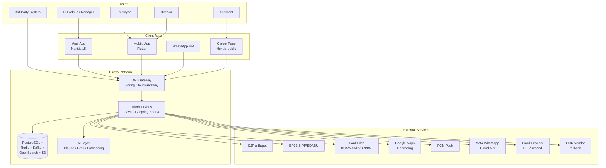
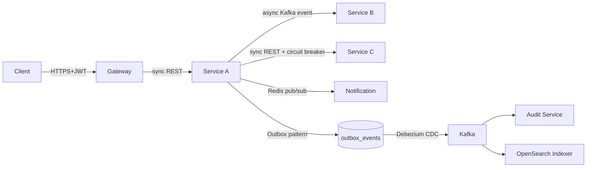
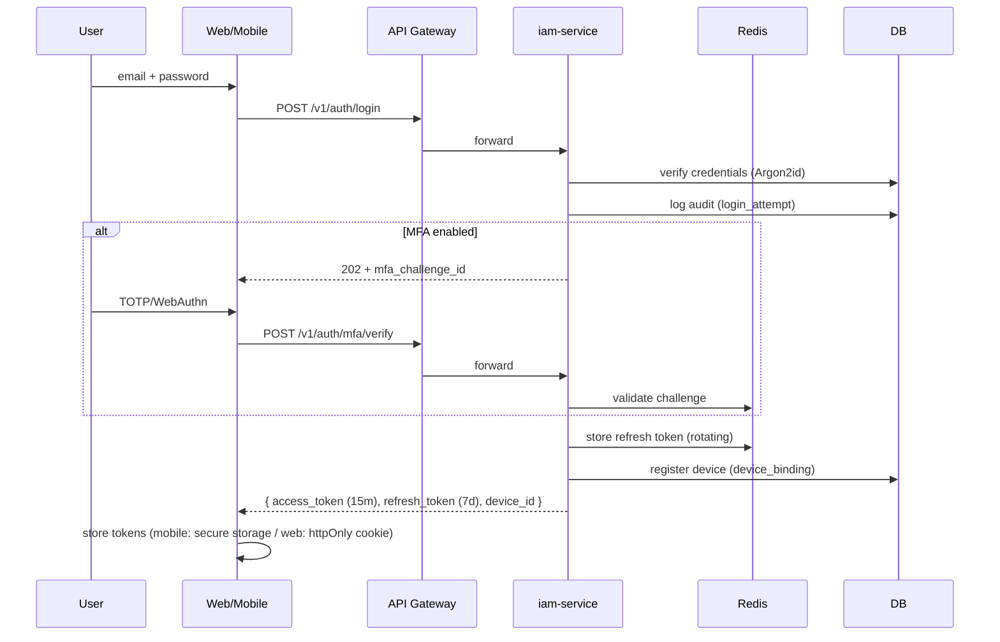
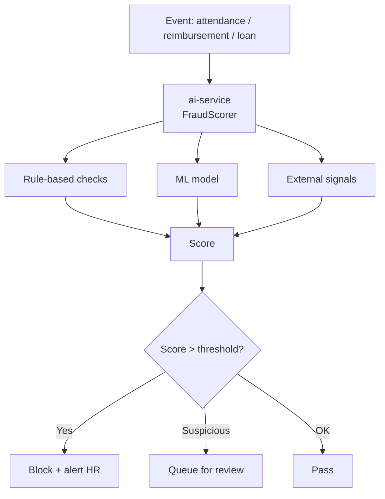
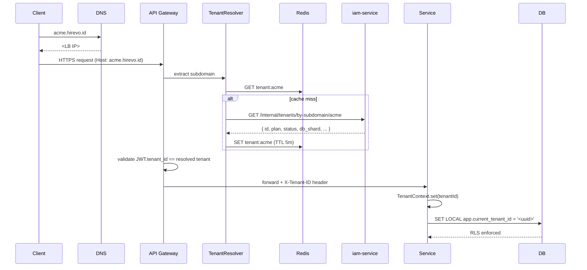
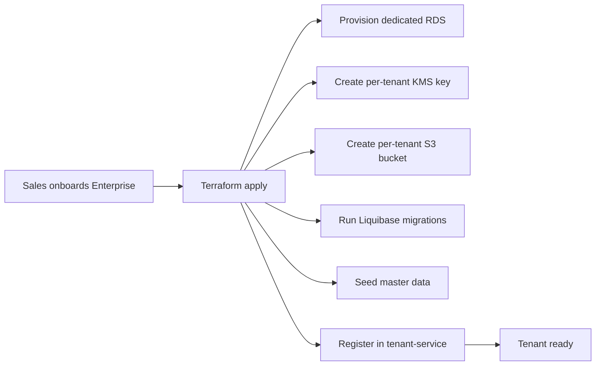

# Architecture — Hirevo HRIS

**Stack:**
- **Backend**: Java 21, Spring Boot 3.3, Spring Security 6, Spring Cloud Gateway, Spring Data JPA + Hibernate, Liquibase, Resilience4j.
- **Auth**: JWT (RS256) + Refresh Token + WebAuthn (FIDO2) + TOTP.
- **Database**: PostgreSQL 16 (primary + read replica), partitioning + RLS.
- **Cache & Pub-Sub**: Redis 7 (cache, session, rate limit, distributed lock).
- **Messaging**: Apache Kafka (event-driven) + RabbitMQ (jobs).
- **Search**: OpenSearch (employee search, audit search, candidate full-text).
- **Object Storage**: S3-compatible (AWS S3 / GCS / Cloudflare R2).
- **Container & Orchestration**: Docker + Kubernetes (EKS/GKE).
- **Frontend Web**: Next.js 15 (App Router), React 19, TypeScript 5, Tailwind CSS 4, shadcn/ui, TanStack Query, Zustand.
- **Mobile**: Flutter 3.27, Riverpod, Dio, Hive (offline), ML Kit (face + liveness).
- **AI**: Anthropic Claude (Haiku/Sonnet) + Groq llama-3 fallback, embedding `bge-m3` (self-host) untuk RAG.
- **Observability**: OpenTelemetry → Prometheus + Grafana + Loki + Tempo + Sentry.
- **CI/CD**: GitHub Actions → ArgoCD (GitOps).
- **Cloud**: AWS Jakarta primary, GCP Jakarta as DR (active-passive).

---

## 1. High-Level Architecture (C4 Context)



---

## 2. Microservice Design

### 2.1 Service Decomposition (Bounded Context)

| # | Service | Responsibility | DB Schema |
|---|---------|----------------|-----------|
| 1 | **iam-service** | Auth, MFA, JWT, RBAC, device binding, session | `iam` |
| 2 | **tenant-service** | Multi-tenant lifecycle, plans, billing, subdomain | `tenant` |
| 3 | **employee-service** | Employee, contracts, org structure, documents | `employee` |
| 4 | **attendance-service** | Clock-in/out, GPS, face match, anti-fraud | `attendance` |
| 5 | **leave-service** | Leave types, balance, requests, holidays | `leave` |
| 6 | **payroll-service** | Payroll runs, payslips, components, bank files | `payroll` |
| 7 | **tax-service** | PPh 21 engine (TER + annual), bukti potong | `tax` |
| 8 | **bpjs-service** | BPJS calc, SIPP/EDABU export | `bpjs` |
| 9 | **reimbursement-service** | Reimbursement, cash advance, OCR fraud | `reimburse` |
| 10 | **loan-service** | Employee loans, installments, eligibility | `loan` |
| 11 | **recruitment-service** | ATS, candidates, applications, interviews | `recruitment` |
| 12 | **performance-service** | OKR, reviews, 360, 1-on-1 | `performance` |
| 13 | **asset-service** | Asset master, assignment, maintenance | `asset` |
| 14 | **workflow-service** | Generic approval engine (cross-module) | `workflow` |
| 15 | **notification-service** | In-app, email, push, WA, SMS | `notif` |
| 16 | **document-service** | File upload (S3), virus scan, signed URL | `document` |
| 17 | **ai-service** | Chatbot, OCR, fraud scoring, embedding RAG | `ai` |
| 18 | **audit-service** | Immutable audit log, search, export | `audit` |
| 19 | **integration-service** | Bank export, DJP/BPJS API, accounting sync | `integration` |
| 20 | **reporting-service** | Dashboard aggregates, custom reports, exports | `reporting` |

### 2.2 Communication Patterns



**Rules:**
- **Sync REST** untuk read-after-write yang user butuh immediate.
- **Async event (Kafka)** untuk cross-service state propagation (e.g. `EmployeeHired` → notif + audit + integration).
- **Outbox pattern** untuk transactional event publishing (no dual-write).
- **Saga (orchestration)** untuk payroll run cross-service (payroll → tax → bpjs → notification).

### 2.3 Shared Libraries (Maven modules)

```
com.hirevo.platform
├── hirevo-bom                    # Bill of materials (versions)
├── hirevo-core                   # Common DTOs, exceptions, utils
├── hirevo-security                # JWT filter, RBAC annotations
├── hirevo-tenant                  # TenantContext, RLS helper
├── hirevo-audit                   # @Audited annotation, log producer
├── hirevo-messaging               # Kafka producer/consumer wrapper
├── hirevo-integration-bank        # Bank file generators (strategy pattern)
├── hirevo-rule-engine             # Tax & BPJS rule-pack engine
└── hirevo-test-fixtures           # Shared test fixtures
```

---

## 3. API Design

### 3.1 Conventions
- **Base**: `https://api.hirevo.id/v1/{module}/...`
- **Tenant resolution**: subdomain (`acme.hirevo.id`) → header `X-Tenant-ID` (resolved by gateway).
- **Auth**: `Authorization: Bearer <JWT>`.
- **Versioning**: URI path (`/v1`, `/v2`). Breaking changes = new version.
- **Pagination**: cursor-based `?limit=20&cursor=<base64>`. Response: `{ data, next_cursor, total? }`.
- **Filtering**: `?filter[field]=value&filter[other][gte]=10`.
- **Sorting**: `?sort=-created_at,name`.
- **Field selection**: `?fields=id,name,email`.
- **Idempotency**: `Idempotency-Key` header untuk POST yang sensitif (payroll run, payment).
- **Rate limit**: per tenant + per user, response `X-RateLimit-*`.
- **Error format** (RFC 7807):
  ```json
  { "type":"about:blank", "title":"Validation Failed",
    "status":400, "detail":"...", "instance":"/v1/employees/123",
    "errors":[{ "field":"email", "code":"invalid_format" }] }
  ```

### 3.2 Endpoint Group Outline (lihat detail di [06-API-SPEC.md](06-API-SPEC.md))

```
/v1/auth/*                    # login, refresh, logout, MFA, WebAuthn
/v1/tenants/*                 # tenant ops (super-admin)
/v1/me                        # current user/employee
/v1/employees/*               # CRUD employees
/v1/contracts/*               # employment contracts
/v1/orgs/{companies,branches,departments,positions}
/v1/attendance/*              # clock-in, logs, overtime
/v1/leaves/{types,balances,requests}
/v1/payroll/{periods,runs,payslips}
/v1/tax/{profiles,calculations,bukti-potong}
/v1/bpjs/{profiles,calculations,exports}
/v1/reimbursements/*
/v1/loans/*
/v1/recruitments/{jobs,candidates,applications,interviews,offers}
/v1/performance/{cycles,objectives,reviews}
/v1/assets/*
/v1/workflows/*               # approval workflows
/v1/notifications/*
/v1/documents/*               # signed URL upload
/v1/ai/{chat,ocr,score}
/v1/reports/*
/v1/audit/*
/v1/webhooks/*
```

### 3.3 GraphQL?
- **Tidak untuk MVP**. REST cukup. Pertimbangkan GraphQL gateway di Phase 3 untuk mobile efficiency.

---

## 4. Security Design ⭐

### 4.1 Authentication Flow



### 4.2 JWT Structure (RS256)

```json
{
  "iss": "https://api.hirevo.id",
  "sub": "user_<uuid>",
  "tenant_id": "<uuid>",
  "employee_id": "<uuid>",
  "roles": ["hr_admin"],
  "permissions": ["employee.read", "payroll.run"],
  "device_id": "<uuid>",
  "session_id": "<uuid>",
  "iat": 1750000000,
  "exp": 1750000900,
  "jti": "<uuid>"
}
```
- **Access token**: 15 menit, RS256, public keys via JWKS endpoint.
- **Refresh token**: opaque (random 256-bit), stored hashed in Redis (`refresh:{hash}` → metadata), TTL 7 hari (rotating on use).
- **Revocation**: blacklist `jti` di Redis dengan TTL = remaining exp.

### 4.3 MFA
- **TOTP** (RFC 6238): default, via Google Auth / Authy.
- **WebAuthn (FIDO2)**: untuk HR Admin / Director / IT Admin (preferred).
- **SMS**: only for recovery, marked low-trust.
- **Recovery codes**: 10x one-time codes, generated at MFA enrollment.
- **Wajib** untuk role: `super_admin`, `hr_admin`, `finance`, `it_admin`.
- **Per-tenant policy**: admin bisa enforce MFA untuk semua user.

### 4.4 RBAC + ABAC

**Roles (system + custom):**
| Role | Scope |
|------|-------|
| super_admin | Full tenant access |
| hr_admin | All HR modules |
| hr_recruiter | Recruitment only |
| finance | Payroll + Reimbursement |
| manager | Team scope (direct reports) |
| employee | Self only |
| auditor | Read-only all |
| it_admin | Tenant config + SSO + roles |

**Permission format**: `<module>.<action>` (e.g. `payroll.run`, `employee.read`, `leave.approve`).
**ABAC attributes**: `branch_id`, `department_id`, `employee_id` (self), `manager_id` (subordinate).

```java
@PreAuthorize("hasPermission(#employeeId, 'employee', 'read')")
public Employee getEmployee(UUID employeeId) { ... }

// Custom PermissionEvaluator checks:
// - role has 'employee.read'
// - target employee is in same branch/dept as user (ABAC)
// - OR user is the employee themselves
// - OR user is manager of target
```

### 4.5 Encryption

| Layer | Method |
|-------|--------|
| In-transit | TLS 1.3, HSTS, cert pinning di mobile |
| At-rest (DB) | Postgres TDE (cloud-managed: RDS encryption / AWS KMS) |
| At-rest (S3) | SSE-KMS per-tenant key |
| Field-level | AES-256-GCM, envelope encryption via KMS, fields: `nik`, `npwp`, `bank_account_no`, `bpjs_no`, `salary_amount` (optional) |
| Backup | Encrypted snapshots |
| Password | Argon2id (m=64MiB, t=3, p=4) |
| Token | JWT signed RS256 (4096-bit) |

**Envelope encryption:**
- Per-tenant DEK (Data Encryption Key) wrapped by KEK (Key Encryption Key) in AWS KMS / GCP KMS.
- DEK cached in Redis with 5-min TTL.
- Key rotation: KEK auto-rotate yearly, DEK rotate every 90 hari (re-encrypt async).

### 4.6 Device Binding

```sql
CREATE TABLE trusted_devices (
  id              UUID PRIMARY KEY,
  tenant_id       UUID NOT NULL,
  user_id         UUID NOT NULL,
  device_fingerprint VARCHAR(255) NOT NULL,   -- hash of (UA + OS + browser/version + screen)
  device_name     VARCHAR(100),                -- 'Edi iPhone 15'
  platform        VARCHAR(20),                 -- 'android','ios','web'
  push_token      VARCHAR(255),                -- FCM
  last_ip         INET,
  last_geo_country VARCHAR(2),
  trust_level     VARCHAR(20),                 -- 'trusted','new','suspicious'
  enrolled_at     TIMESTAMPTZ,
  last_active_at  TIMESTAMPTZ,
  revoked_at      TIMESTAMPTZ
);
```
- **First login from new device**: send notif email + push to existing devices, require MFA challenge.
- **Max 5 trusted devices** per user (configurable per tenant), oldest auto-revoked.
- **Anomaly**: country mismatch, impossible travel → force re-MFA.

### 4.7 Session Management
- **Stateful** refresh token in Redis (revokable).
- **Stateless** access JWT (15m).
- **Inactivity timeout**: 30 menit (configurable).
- **Concurrent session limit** per role: employee 3, admin 1 (configurable).
- **Force logout** (admin action) → revoke refresh + blacklist jti.

### 4.8 Rate Limiting & Anti-Abuse
- Per IP: 100 req/min global, 10 login attempts/min.
- Per tenant: based on plan (Free: 1k/hr, Starter: 10k, Pro: 100k, Enterprise: unlimited).
- Per user: 60 req/min default.
- **Brute force**: progressive lockout (1m → 5m → 30m → 24h).
- **CAPTCHA** (hCaptcha) after 3 failed logins.
- Implementation: Redis sliding window (Resilience4j RateLimiter + custom).

### 4.9 Anti-Fraud (Cross-Module Engine)



**Signals:**
- Attendance: mock GPS flag, speed teleport, face mismatch, time anomaly, IP geo.
- Reimbursement: image manipulation (ELA), pHash dup, OCR text dup, vendor outlier, amount outlier.
- Loan: salary mismatch, multiple concurrent loans, employment status churn.

### 4.10 Secrets Management
- AWS Secrets Manager / GCP Secret Manager.
- Spring `spring-cloud-aws-secrets-manager` or `spring-cloud-gcp-secretmanager`.
- No secret in `application.yml` ever.
- Database password rotation 90 hari.

---

## 5. Audit Trail Design

### 5.1 Goals
- Every state change to sensitive entity logged.
- **Immutable** (append-only, no UPDATE/DELETE allowed).
- **Tamper-evident** (hash chain).
- Retention 5 thn (payroll-related 10 thn).
- Search-friendly (OpenSearch indexed).

### 5.2 Schema

```sql
CREATE TABLE audit_logs (
  id              BIGSERIAL,
  tenant_id       UUID NOT NULL,
  trace_id        UUID NOT NULL,                  -- OpenTelemetry trace
  user_id         UUID,
  impersonator_user_id UUID,                       -- if super-admin impersonating
  service         VARCHAR(50) NOT NULL,            -- 'payroll-service'
  module          VARCHAR(50) NOT NULL,
  entity_type     VARCHAR(50) NOT NULL,
  entity_id       UUID NOT NULL,
  action          VARCHAR(30) NOT NULL,            -- 'create','update','delete','approve','run','export','login','password_change','mfa_enroll','impersonate'
  changes         JSONB,                            -- {field: {old, new}} — sensitive fields masked
  metadata        JSONB,                            -- {ip, user_agent, request_id}
  prev_hash       BYTEA,                            -- SHA-256 of prev record (hash chain)
  record_hash     BYTEA,                            -- SHA-256 of this record
  created_at      TIMESTAMPTZ NOT NULL DEFAULT NOW(),
  PRIMARY KEY (id, created_at)
) PARTITION BY RANGE (created_at);
```

### 5.3 Implementation

**Annotation-based capture (Spring AOP):**
```java
@Audited(module="payroll", action="approve")
public PayrollRun approve(UUID payrollRunId, ApproveCmd cmd) { ... }
```

**Hibernate Envers** untuk auto-track entity changes pada tabel kritis (employee, contract, salary_structure).

**Kafka pipeline:**
```
Service → audit_event topic → audit-service consumer
                              → INSERT audit_logs
                              → INSERT OpenSearch (async)
                              → compute hash chain (Redis distributed lock per tenant)
```

### 5.4 Tamper Detection
- Periodic job (daily) verify hash chain: `record_hash == SHA256(prev_hash || canonical_json(record))`.
- If broken → alert SOC + freeze writes for that tenant.

### 5.5 Sensitive Field Masking
- `salary_amount` → `***`
- `nik`, `npwp`, `bank_account_no` → last 4 digits only
- Configurable via `@AuditMask` field annotation.

---

## 6. Multi-Tenant Design

### 6.1 Strategy: **Hybrid**

| Tenant Tier | DB Isolation | Schema | Notes |
|-------------|--------------|--------|-------|
| Free / Starter | Shared DB, shared schema | RLS by `tenant_id` | Lowest cost |
| Growth / Pro | Shared DB, shared schema | RLS + dedicated read-replica pool | Mid-tier |
| Enterprise | Dedicated schema OR dedicated DB cluster | Full isolation | Provisioned via Terraform |

### 6.2 Tenant Resolution Flow



### 6.3 RLS Implementation (Spring Boot + JPA)

```java
@Component
public class TenantConnectionInterceptor implements DataSourceInterceptor {
  @Override
  public void onConnectionAcquired(Connection conn) throws SQLException {
    String tenantId = TenantContext.getRequired();
    try (Statement st = conn.createStatement()) {
      st.execute("SET LOCAL app.current_tenant_id = '" + tenantId + "'");
    }
  }
}
```

```sql
-- Apply RLS policy ke semua tabel
ALTER TABLE employees ENABLE ROW LEVEL SECURITY;
CREATE POLICY tenant_isolation ON employees
  USING (tenant_id = current_setting('app.current_tenant_id', true)::uuid);

-- Bypass role untuk admin tasks (super-admin only, with audit)
CREATE ROLE hirevo_super;
GRANT BYPASS ROW LEVEL SECURITY TO hirevo_super;
```

### 6.4 Enterprise Provisioning Flow



### 6.5 Cross-Tenant Operations
- **Forbidden** at API layer (RLS enforces).
- Super-admin tools have **explicit `--cross-tenant` flag** logged in audit.
- Background jobs (e.g. daily fraud scan): run per-tenant, never aggregate across.

---

## 7. Deployment Design

### 7.1 Environment Topology

```
Production (AWS Jakarta)
├── ap-southeast-3 (primary)
│   ├── EKS cluster: hirevo-prod (3 AZ, m6i.2xlarge × 6-30 nodes auto-scale)
│   ├── RDS Aurora PostgreSQL Multi-AZ (db.r6g.2xlarge primary + 2 read replicas)
│   ├── ElastiCache Redis (cluster mode, 3 shards × 2 replicas)
│   ├── MSK (Kafka)
│   ├── OpenSearch
│   ├── S3 (per-tenant prefix for Enterprise)
│   └── CloudFront + WAF + Shield
├── ap-southeast-1 (DR — warm standby)
│   └── Aurora Global Database, RPO < 1s, RTO < 1m
└── Staging & Dev (single AZ, smaller)
```

### 7.2 Kubernetes Layout

```yaml
namespaces:
  - hirevo-system        # ArgoCD, ingress, cert-manager, observability
  - hirevo-iam
  - hirevo-tenant
  - hirevo-employee
  - hirevo-attendance
  - hirevo-leave
  - hirevo-payroll       # CPU-heavy: dedicated node pool (compute-optimized)
  - hirevo-tax
  - hirevo-bpjs
  - hirevo-reimbursement
  - hirevo-loan
  - hirevo-recruitment   # Phase 2
  - hirevo-performance   # Phase 2
  - hirevo-asset         # Phase 2
  - hirevo-workflow
  - hirevo-notification
  - hirevo-document
  - hirevo-ai            # GPU node pool for embedding (optional)
  - hirevo-audit
  - hirevo-integration
  - hirevo-reporting
```

**Per-service resources (example payroll-service):**
```yaml
apiVersion: apps/v1
kind: Deployment
metadata:
  name: payroll-service
  namespace: hirevo-payroll
spec:
  replicas: 3
  template:
    spec:
      containers:
      - name: app
        image: ghcr.io/hirevo/payroll-service:1.2.3
        resources:
          requests: { cpu: "1", memory: "2Gi" }
          limits:   { cpu: "2", memory: "4Gi" }
        env:
        - name: SPRING_PROFILES_ACTIVE
          value: prod
        - name: DB_HOST
          valueFrom: { secretKeyRef: { name: db-credentials, key: host } }
        livenessProbe:
          httpGet: { path: /actuator/health/liveness, port: 8080 }
        readinessProbe:
          httpGet: { path: /actuator/health/readiness, port: 8080 }
        startupProbe:
          httpGet: { path: /actuator/health, port: 8080 }
          failureThreshold: 30
---
apiVersion: autoscaling/v2
kind: HorizontalPodAutoscaler
metadata: { name: payroll-service-hpa }
spec:
  scaleTargetRef: { kind: Deployment, name: payroll-service }
  minReplicas: 3
  maxReplicas: 20
  metrics:
  - type: Resource
    resource: { name: cpu, target: { type: Utilization, averageUtilization: 70 } }
```

### 7.3 CI/CD Pipeline

```mermaid
flowchart LR
  PR[PR opened] --> Lint[Checkstyle + Spotless]
  Lint --> Test[Unit + Integration test]
  Test --> Sec[SAST: SonarQube + Snyk + Trivy]
  Sec --> Build[Maven build]
  Build --> Image[Docker build & push GHCR]
  Image --> Sign[Cosign sign]
  Sign --> Merge{merge to main?}
  Merge -->|Yes| ArgoStaging[ArgoCD sync → staging]
  ArgoStaging --> E2E[E2E tests staging]
  E2E --> Manual[Manual approval]
  Manual --> ArgoProd[ArgoCD sync → prod canary 10%]
  ArgoProd --> Smoke[Smoke + SLO check]
  Smoke --> FullRoll[Roll to 100%]
```



**Stack:**
- **Source**: GitHub.
- **CI**: GitHub Actions (matrix builds).
- **Registry**: GitHub Container Registry + Cosign signature.
- **CD**: ArgoCD (GitOps), manifests in `hirevo-deploy` repo.
- **Strategy**: Blue/Green for stateless services, canary 10%→50%→100%.
- **DB migration**: Liquibase, applied pre-deploy via init container, with manual approval for destructive changes.

### 7.4 Observability

| Layer | Tool |
|-------|------|
| Metrics | Prometheus + Grafana |
| Tracing | OpenTelemetry → Tempo |
| Logging | OpenTelemetry → Loki (structured JSON) |
| Errors | Sentry |
| Uptime | Better Stack / Pingdom external |
| Synthetic | k6 cloud scripts hourly |

**Per-service:**
- Micrometer → Prometheus scrape `/actuator/prometheus`.
- Spring Boot 3 auto OpenTelemetry instrumentation.
- Log format JSON dengan `tenant_id`, `trace_id`, `user_id`, `request_id`.

**Key SLIs/SLOs:**
- API availability: 99.9% (Pro), 99.95% (Enterprise).
- API latency p95 < 400ms (read), p99 < 1s.
- Payroll run success rate > 99.5%.
- Fraud detection false-positive rate < 5%.
- Mobile crash-free rate > 99.5%.

### 7.5 Disaster Recovery

| Scenario | RPO | RTO | Mitigation |
|----------|-----|-----|------------|
| AZ failure | 0 | 0 | Multi-AZ deployment |
| Region failure | < 1m | < 30m | Aurora Global DB; ArgoCD apply to DR region |
| Accidental data delete | 24h | < 4h | Point-in-time restore (7-day window) |
| Ransomware | 0 (immutable backup) | < 8h | Versioned S3 backups + air-gapped weekly snapshot |
| Compromised admin account | — | < 5m | Force logout all sessions; rotate KMS keys; audit review |

### 7.6 Cost Optimization
- **Spot instances** untuk worker pool (payroll batch, OCR, embedding).
- **Reserved instances** untuk baseline (DB, IAM, gateway).
- **S3 Intelligent Tiering** untuk documents.
- **Aurora auto-scaling** untuk read capacity.
- **CloudFront** untuk static assets + payslip PDF (signed URL).
- **VPC endpoints** untuk S3/KMS (no NAT cost).

### 7.7 Compliance Hardening
- **PSE Kominfo**: register `hirevo.id`.
- **Data residency**: enforce `ap-southeast-3` region only.
- **SOC 2 Type II**: target Year 2.
- **ISO 27001**: target Year 3.
- **Penetration test**: yearly + after major release.
- **Bug bounty**: open via HackerOne post-GA.
- **DPO** (Data Protection Officer): appointed, contactable.

---

## 8. Architecture Decision Records (ADR) — to be created

Each significant decision documented in `docs/adr/NNN-title.md`:
- ADR-001: Use Java 21 + Spring Boot 3 (vs NestJS / Go)
- ADR-002: Hybrid multi-tenancy (RLS + dedicated schema)
- ADR-003: Kafka for event-driven (vs RabbitMQ only)
- ADR-004: Self-host face recognition (vs AWS Rekognition)
- ADR-005: REST first, GraphQL deferred
- ADR-006: Liquibase (vs Flyway)
- ADR-007: ArgoCD (vs Flux)
- ADR-008: Hibernate Envers + custom audit (vs CDC-only)
- ADR-009: WebAuthn + TOTP for MFA (no SMS primary)
- ADR-010: Aurora Global DB for DR (vs read-replica + manual failover)
