# Use Cases & Activity Diagrams — Hirevo HRIS

Mermaid diagrams. Each module: use case diagram (actors → use cases) + activity diagrams untuk flow utama.

---

## 1. Aktor Sistem

```mermaid
flowchart TB
  SA[Super Admin Tenant]
  HRA[HR Admin]
  HRM[HR Manager / Recruiter]
  FIN[Finance]
  MGR[Line Manager]
  EMP[Employee]
  CAN[Candidate]
  DIR[Director / Executive]
  AUD[Auditor]
  ITA[IT Admin Tenant]
  HRV[Hirevo Super Admin]
  SYS[3rd-party System]
  BOT[AI Bot / Scheduled Job]
```

---

## 2. Use Case Diagram per Modul

### 2.1 Authentication & Tenant
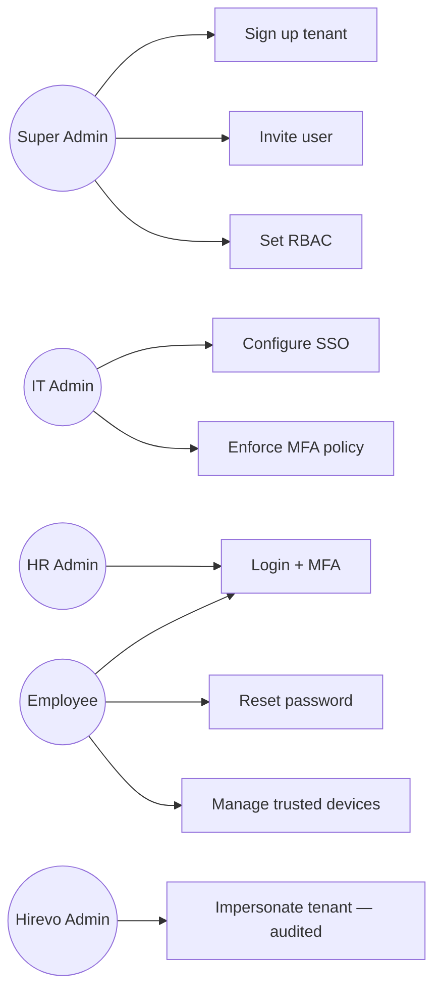

### 2.2 Employee Management
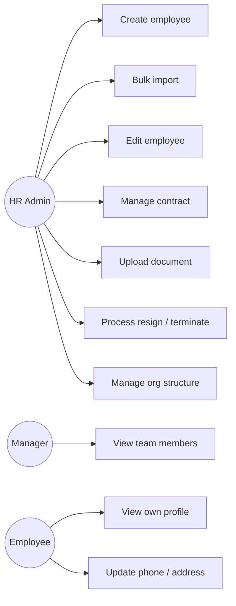

### 2.3 Attendance ⭐
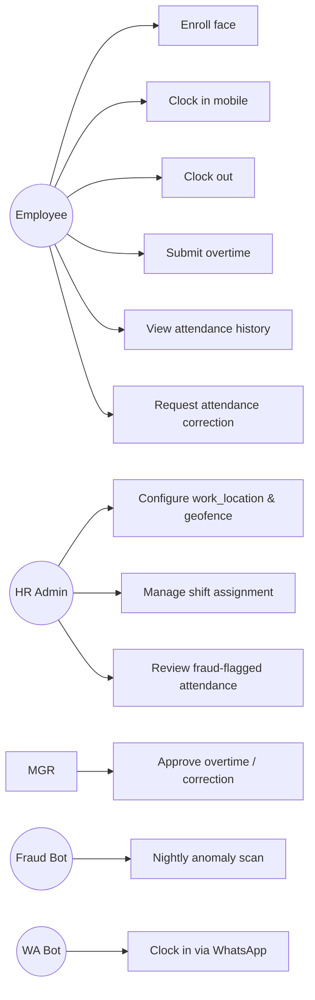

### 2.4 Leave
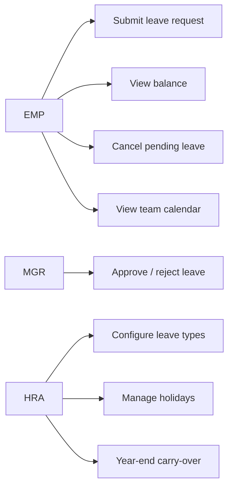

### 2.5 Payroll
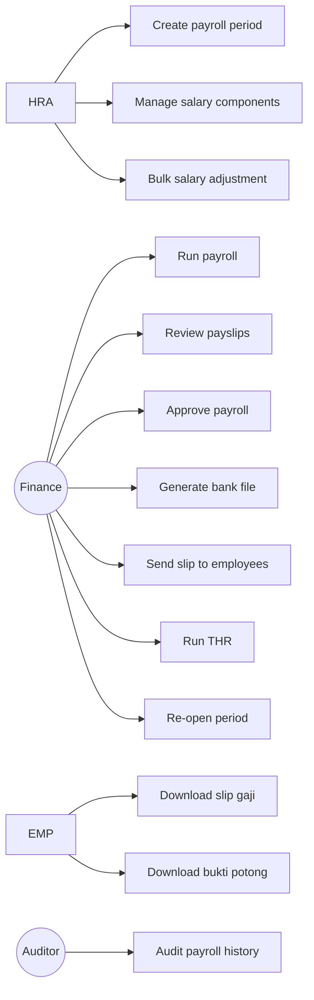

### 2.6 Reimbursement
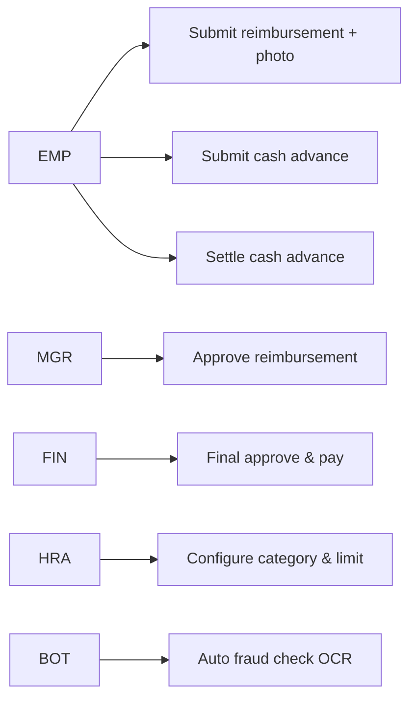

### 2.7 Loan
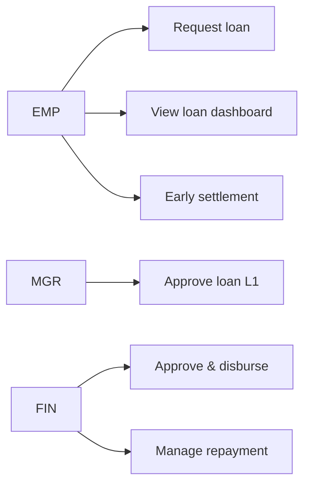

### 2.8 Recruitment (Phase 2)
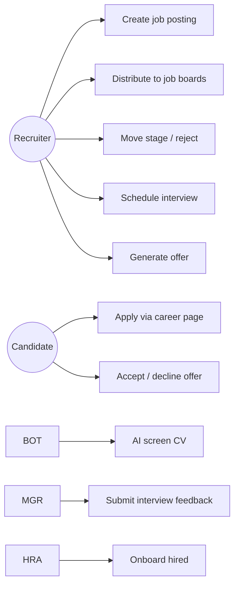

### 2.9 Performance (Phase 2)
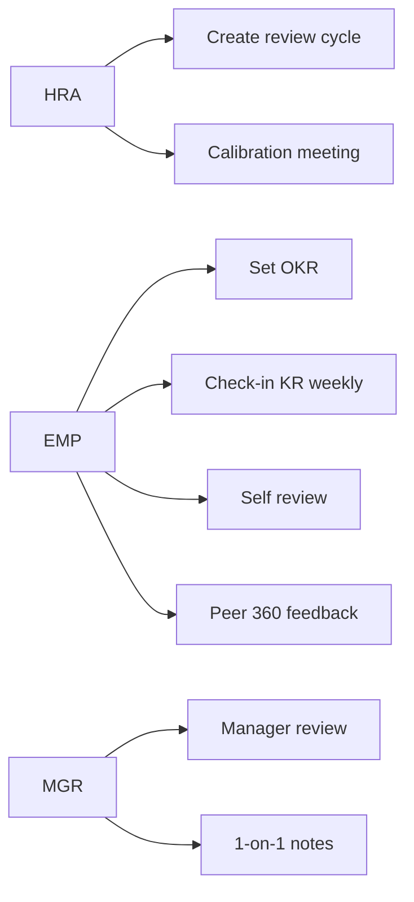

### 2.10 Asset (Phase 2)
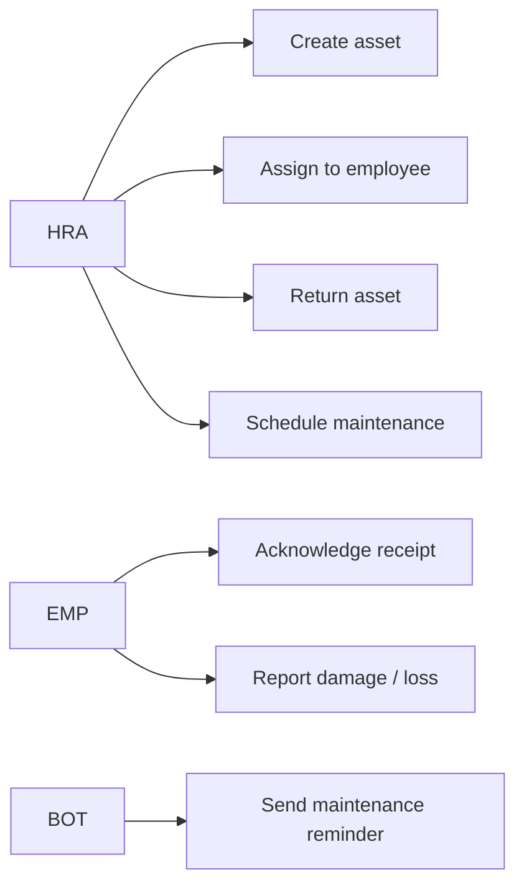

### 2.11 Dashboard & Reports
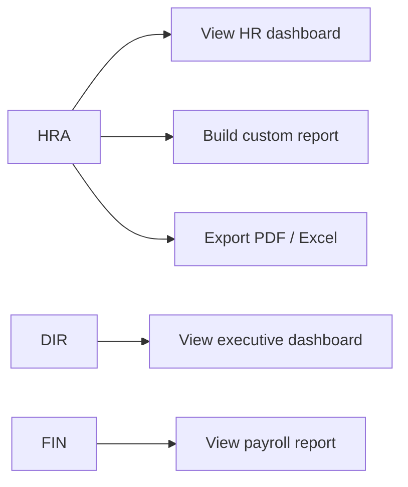

### 2.12 AI Assistant
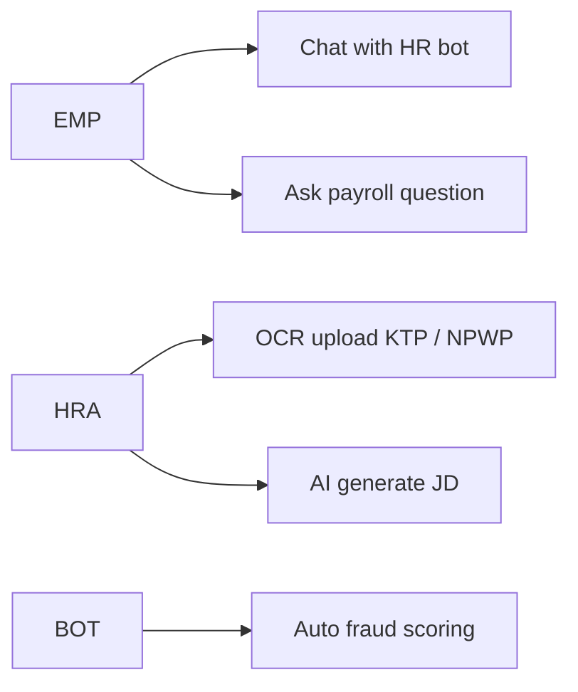

---

## 3. Activity Diagrams — Flow Utama

### 3.1 Login + MFA (US-002)

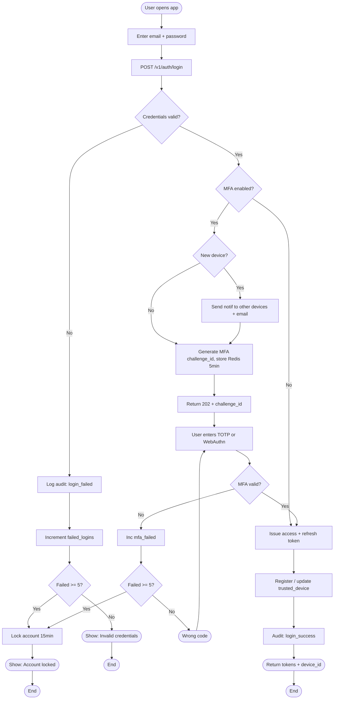

### 3.2 Mobile Clock-In with Face + GPS + Anti-Fraud (US-020)

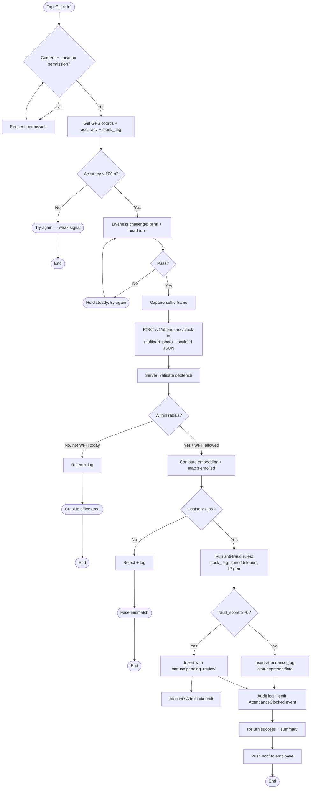

### 3.3 Payroll Run End-to-End (US-040 + 043 + 044)

```mermaid
flowchart TB
  Start([Finance clicks 'Run Payroll']) --> Sel[Select period + scope]
  Sel --> Create[POST /v1/payroll/runs]
  Create --> Status1[status=draft]
  Status1 --> Calc[POST /v1/payroll/runs/:id/calculate]
  Calc --> Async[Publish PayrollCalculationRequested event]
  Async --> Worker[payroll-worker pulls job]
  Worker --> Loop[For each employee in scope]
  Loop --> Attend[Fetch attendance & overtime period]
  Attend --> Comp[Resolve salary_components + structure]
  Comp --> Earn[Calc earnings: base + tunjangan + lembur + THR / bonus]
  Earn --> Bpjs[Call bpjs-service via REST: calc 5 program]
  Bpjs --> Tax[Call tax-service: calc PPh 21 TER monthly / annual]
  Tax --> Deduct[Sum deductions: BPJS_ee + PPh + loan_installment + other]
  Deduct --> Net[net = gross - deductions]
  Net --> Insert[INSERT payslip + payslip_lines + tax_calc + bpjs_calc]
  Insert --> More{More employees?}
  More -->|Yes| Loop
  More -->|No| Aggregate[Compute run totals]
  Aggregate --> Status2[status=calculated]
  Status2 --> Notif1[Notify finance: ready to review]
  Notif1 --> Review[Finance reviews summary + individual slips]
  Review --> Edit{Any adjustment?}
  Edit -->|Yes| RecalcOne[Recalc single employee] --> Review
  Edit -->|No| ReqApp[Request approval]
  ReqApp --> Status3[status=reviewed]
  Status3 --> Approver[Different user — 4-eyes principle]
  Approver --> ApprDec{Approve?}
  ApprDec -->|Reject| Status4[status=cancelled] --> EndR([End])
  ApprDec -->|Approve| Status5[status=approved]
  Status5 --> ParallelGen[Parallel: PDF slip + bank file + bukti potong]
  ParallelGen --> Send[Send notif: email + push + WA]
  Send --> Status6[status=paid after pay_date]
  Status6 --> Audit[Audit log every transition]
  Audit --> End([End])
```

### 3.4 Reimbursement with OCR + Fraud Detection (US-060 + 061)

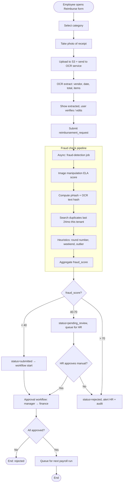

### 3.5 Leave Request + Multi-Level Approval (US-030 + 031)

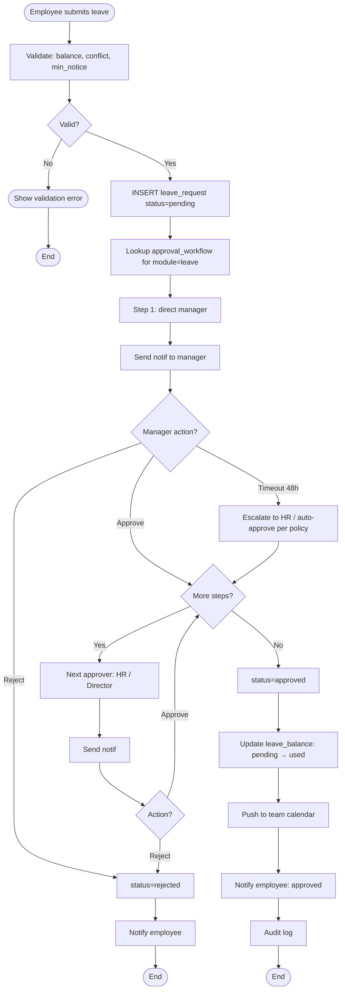

### 3.6 Recruitment — Apply to Hire (Phase 2)

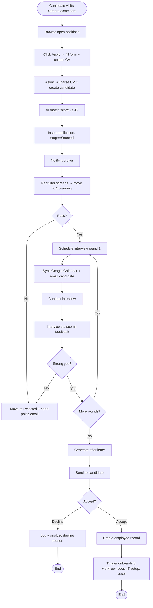

### 3.7 Employee Loan Request (US-070)

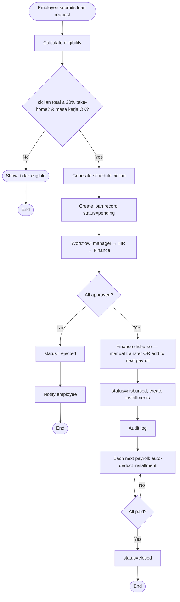

### 3.8 Daily Fraud Scan Bot (US-133)

```mermaid
flowchart TB
  Cron([02:00 daily cron]) --> Loop[For each active tenant]
  Loop --> Attend[Scan yesterday attendance]
  Attend --> A1[Find: late_count outlier per employee]
  A1 --> A2[Find: clock-in pattern same coords always]
  A2 --> A3[Find: face match score borderline trending down]
  Loop --> Reim[Scan last 7 days reimbursement]
  Reim --> R1[Cross-employee duplicate receipts]
  R1 --> R2[Vendor outlier]
  Loop --> Loan[Scan loan exposure]
  Loan --> L1[Employees with cicilan > 25%]
  A3 --> Agg[Aggregate report]
  R2 --> Agg
  L1 --> Agg
  Agg --> Digest[Generate digest per tenant]
  Digest --> Send[Email + in-app to HR Admin]
  Send --> Audit[Audit job execution]
  Audit --> End([End])
```

### 3.9 Tenant Onboarding Wizard (US-004)

```mermaid
flowchart TB
  Start([New tenant signup confirmed]) --> Step1[Step 1: Company info]
  Step1 --> Step2[Step 2: Add branches]
  Step2 --> Step3[Step 3: Invite users + assign roles]
  Step3 --> Step4[Step 4: Choose payroll components template]
  Step4 --> Step5[Step 5: Upload karyawan Excel]
  Step5 --> Validate[Validate rows, show errors]
  Validate --> Fix{Errors?}
  Fix -->|Yes| Edit[Edit Excel + re-upload] --> Validate
  Fix -->|No| Import[Background job import]
  Import --> Wait[Show progress]
  Wait --> Done[Notify done]
  Done --> Checklist[Setup checklist 80% complete]
  Checklist --> Next[Suggest next: enroll faces, set work_location]
  Next --> End([End])
```

### 3.10 Year-End Tax Reconciliation (US-048)

```mermaid
flowchart TB
  Cron([January 1, 03:00 cron]) --> Loop[For each tenant with payroll active]
  Loop --> Employees[For each employee active in prev year]
  Employees --> Sum[Sum YTD gross, deductions, PPh paid]
  Sum --> Calc[Annual progressive PPh calc]
  Calc --> Diff{YTD paid vs annual?}
  Diff -->|Underpaid| Owe[Mark: employee owes Rp X — deduct next payroll]
  Diff -->|Overpaid| Refund[Mark: refund Rp X via next payroll]
  Diff -->|Equal| OK[No adjustment]
  Owe --> GenBP
  Refund --> GenBP
  OK --> GenBP[Generate Bukti Potong 1721-A1 PDF + e-Bupot XML]
  GenBP --> Upload[Upload to S3, set signed URL]
  Upload --> Notif[Notify HR + Employee: BP ready]
  Notif --> End([End])
```
