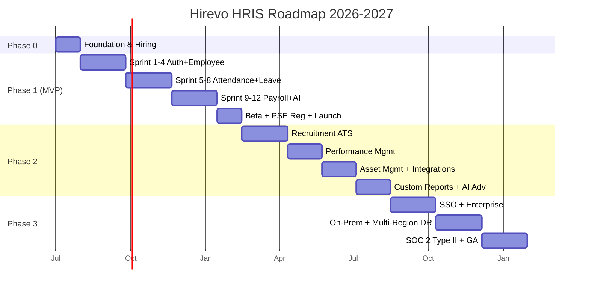

# Development Roadmap — Hirevo HRIS

**Horizon:** Q3 2026 → Q4 2027 (5 quarter)
**Approach:** Phased delivery dengan beta launches per phase.

---

## Timeline Overview

---

## Phase 0 — Foundation (Jul 2026, 1 bulan)

**Goal:** Tim siap kerja, infra dasar berdiri.

### Deliverables
- Tim hire complete: 1 PM (Edi), 4 BE (Java), 2 FE (Next), 2 Mobile (Flutter), 1 DevOps, 1 Designer, 1 QA.
- PT Hirevo Indonesia incorporated.
- Repo monorepo + CI/CD pipeline.
- Local dev env (Docker Compose) running.
- Staging cluster (EKS) provisioned.
- ArgoCD + observability stack.
- Design system v0 di Figma.
- Tax consultant retainer signed.
- Cloud account (AWS Jakarta) setup with cost guardrails.

### Milestone Gate
✅ Hello-world service deploys to staging via PR → ArgoCD pipeline.

---

## Phase 1 — MVP (Aug – Dec 2026, 5 bulan)

**Goal:** Modul core jalan, 10 design-partner tenants pakai di prod.

### Scope (lihat detail [08-SPRINT-BACKLOG.md](08-SPRINT-BACKLOG.md))
1. Auth (MFA, RBAC, device binding)
2. Multi-tenant + RLS
3. Employee Management
4. Attendance ⭐ (GPS + Face + Liveness + Anti-Mock)
5. Leave Management
6. Workflow Engine
7. Payroll + PPh 21 TER + BPJS + Lembur PP 35 + THR
8. Reimbursement (OCR + Fraud)
9. Employee Loan
10. Mobile self-service
11. HR Dashboard
12. AI Chatbot (basic)
13. Audit + Compliance

### Quarterly Milestones

**Q3 2026 (Jul–Sep) — Foundation + Core HR**
- M1 (Jul end): Foundation complete.
- M2 (Aug end): Auth + Tenant + Employee live in staging.
- M3 (Sep end): Attendance + Anti-Fraud live.

**Q4 2026 (Oct–Dec) — Payroll + Launch**
- M4 (Oct end): Leave + Workflow + Lembur done.
- M5 (Nov end): Payroll engine end-to-end approved by tax consultant.
- M6 (Dec mid): Beta with 10 design-partner tenants.
- M7 (Dec end): **MVP GA launch** + PSE Kominfo registered + marketing site.

### Success Criteria
- 10 paying tenants on day 1.
- Payroll calculation 100% match independent tax-consultant manual calc untuk 50 sample employees.
- Mobile attendance < 5% rejection rate (excluding actual fraud).
- Uptime > 99% post-launch.
- NPS from beta tenants ≥ 40.

### Risks
- **Tax engine accuracy** — mitigasi: 200+ golden tests + weekly tax consultant review + first 3 tenants get manual reconciliation.
- **Face recognition perf on low-end Android** — mitigasi: vendor (AWS Rekognition) fallback.
- **PSE Kominfo delay** — mitigasi: start application Sept (early), use temporary workaround for early tenants.

---

## Phase 2 — Talent + Operations (Jan – Aug 2027, 8 bulan)

**Goal:** Hirevo jadi full HR Suite. Recruitment, Performance, Asset, Advanced AI.

### Sub-Phase 2A — Recruitment ATS (Q1 2027)
- Career page, job posting, candidate management.
- AI screening CV (Claude Haiku / embedding cosine).
- Interview scheduling + Google Calendar.
- Offer letter generator.
- Onboarding handoff.

**Target launch:** End of Mar 2027. **Pricing:** Auto-enabled di paket Growth+.

### Sub-Phase 2B — Performance Management (Q2 2027 early)
- OKR cascading.
- Review cycles (self + manager + 360).
- 1-on-1 notes.
- Calibration meeting tool.

**Target launch:** End of May 2027.

### Sub-Phase 2C — Asset Management + Integrations (Q2 2027 late)
- Asset master + QR code.
- Assignment + return + maintenance.
- Depreciation.
- **Integration:** Accurate, Jurnal, Xero (sync payroll journal).
- **Integration:** DJP e-Bupot direct submit.
- **Integration:** BPJS SIPP API.

**Target launch:** End of Jul 2027.

### Sub-Phase 2D — Custom Reports + Advanced AI (Aug 2027)
- Custom report builder (drag-drop).
- Schedule reports + email/Slack.
- **AI:** Payroll Q&A ("kenapa PPh saya naik?").
- **AI:** Fraud detection bot (nightly scan).
- **AI:** Generate JD from role.

**Target launch:** End of Aug 2027.

### Success Criteria Phase 2
- 1500 paying tenants total.
- ATS adoption > 30% of Growth+ tenants.
- Performance module adoption > 20%.
- MRR Rp 2.5 miliar.
- Churn < 2%/month.

---

## Phase 3 — Enterprise & Global-Ready (Sep – Dec 2027, 4 bulan)

**Goal:** Memenangkan deal Enterprise (>500 karyawan), siap untuk ekspansi.

### Sub-Phase 3A — Enterprise Features (Q4 2027 early)
- **SSO**: SAML 2.0 + OIDC.
- **IT Admin tools**: bulk user provisioning (SCIM 2.0).
- **Advanced workflow**: parallel approval, conditional routing.
- **Granular RBAC** + custom role permissions.
- **Data Loss Prevention** policies.
- **IP allowlist** per tenant.
- **Dedicated infra provisioning** automated (Terraform pipeline).

**Target launch:** End of Oct 2027.

### Sub-Phase 3B — On-Prem + Multi-Region DR (Q4 2027 mid)
- **On-Prem package**: Helm chart + offline installer untuk klien BUMN/regulated.
- **Multi-region active-active** dengan Aurora Global Database.
- **DR drill** quarterly.

**Target launch:** End of Nov 2027.

### Sub-Phase 3C — Compliance & GA Enterprise (Q4 2027 late)
- **SOC 2 Type II** audit pass.
- **ISO 27001** Stage 1.
- **Pen-test** by external firm (e.g. Bishop Fox / RSI).
- **Bug bounty** program open (HackerOne).
- **GA Enterprise tier** with SLA 99.95% + dedicated CSM.

**Target:** End of Dec 2027.

### Success Criteria Phase 3
- 10+ Enterprise customers (>500 employees).
- SOC 2 Type II report issued.
- Zero P0 incidents in Q4.
- Enterprise ARR > Rp 5 miliar.

---

## Year 2 (2028) — Outlook (not committed)

- **LMS** (Learning Management).
- **Engagement Survey + Pulse**.
- **Succession Planning** + 9-box.
- **Compensation Benchmarking** (partnership data provider).
- **Workforce Planning** (forecasting AI).
- **Expansion**: pilot di Vietnam / Philippines (port compliance engine).
- **Vertical packages**: HRIS for F&B (multi-outlet shift), for Construction (project-based).
- **Marketplace**: 3rd-party apps & integrations.

---

## Themes Per Quarter

| Quarter | Tema | Headline Feature |
|---------|------|------------------|
| Q3 2026 | Build | Foundation + Auth + Attendance ⭐ |
| Q4 2026 | Launch | Payroll engine + MVP GA |
| Q1 2027 | Talent | Recruitment ATS |
| Q2 2027 | Operate | Performance + Asset + Integrations |
| Q3 2027 | Intelligence | Custom Reports + Advanced AI |
| Q4 2027 | Enterprise | SSO + On-Prem + SOC 2 |

---

## Hiring Roadmap

| Month | Add | Reason |
|-------|-----|--------|
| Jul 2026 | Foundation team (11 people) | MVP start |
| Oct 2026 | +1 BE, +1 QA | Payroll scale |
| Jan 2027 | +2 BE (recruitment + perf), +1 ML eng | Phase 2 |
| Apr 2027 | +1 Mobile, +1 Designer, +1 PM | Phase 2 + UX |
| Jul 2027 | +1 SRE, +1 Security, +1 CSM | Enterprise prep |
| Oct 2027 | +1 Solution Architect, +2 Sales Eng | Enterprise sales |

Total team end-of-2027: ~25 people.

---

## Budget Snapshot (high-level, IDR)

| Phase | Duration | Team Cost | Infra | Vendor (AI, OCR) | Marketing | Total |
|-------|----------|-----------|-------|-------------------|-----------|-------|
| Foundation | 1 bln | 250jt | 5jt | 3jt | 0 | 258jt |
| MVP | 5 bln | 1.25M | 75jt | 25jt | 50jt | **1.4M** |
| Phase 2 | 8 bln | 2.4M | 200jt | 100jt | 400jt | **3.1M** |
| Phase 3 | 4 bln | 1.5M | 250jt | 80jt | 300jt | **2.13M** |
| **Total** | 18 bln | | | | | **~6.9M** |

Plus pen-test, SOC 2 audit, legal/PSE: ~500jt.

**Revenue projection:** MRR Rp 750jt end-2026 → Rp 2.5M end-Q3 2027 → Rp 5M+ end-2027. ARR 2027 ≈ Rp 30–40 miliar.

---

## Go/No-Go Gates

| Gate | Date | Criteria |
|------|------|----------|
| **G1**: Sprint 6 review | Mid-Sep 2026 | Face recognition accuracy ≥ 95% on ID-face test set. **No-go = vendor (Rekognition) within 1 sprint.** |
| **G2**: Payroll engine | End-Nov 2026 | Tax consultant signs off 50 sample calc. **No-go = postpone launch 4 weeks.** |
| **G3**: Beta feedback | Mid-Dec 2026 | NPS ≥ 30, no P0 bug, 8/10 tenants commit to paid. **No-go = additional 4-week polishing sprint.** |
| **G4**: Phase 2 launch | End-Mar 2027 | MVP MRR > Rp 300jt, churn < 4%. **No-go = pause Phase 2, focus retention.** |
| **G5**: Enterprise sales | End-Q3 2027 | 3+ Enterprise pilots in pipeline. **No-go = re-evaluate enterprise GTM.** |
| **G6**: SOC 2 ready | End-Dec 2027 | All controls implemented, evidence collected. |

---

## Stakeholder Communication Cadence

| Audience | Channel | Cadence |
|----------|---------|---------|
| Engineering team | Daily standup + Slack | Daily |
| Product team | Weekly product review | Weekly |
| Investors / Board | Email update + meeting | Monthly + Quarterly |
| Beta tenants | Slack channel + email | Weekly during beta |
| All hands | Town hall | Monthly |
| Tax consultant | Sync call | Weekly during payroll dev |
| Security advisor | Quarterly review | Quarterly |

---

## Open Strategic Questions

1. **Funding**: bootstrap vs raise seed Q4 2026 (target Rp 15–25M)? Recommend: raise seed setelah G3 pass (proof of paying customers).
2. **Geographic expansion**: focus Indonesia until Year 3, atau pilot regional Year 2? Recommend: Indonesia-first, evaluate Q4 2027.
3. **Vertical specialization**: build generic vs vertical-first (F&B / Construction)? Recommend: generic + vertical packaging Q3 2027.
4. **Open source strategy**: open-source compliance engine atau core? Recommend: closed-source MVP, evaluate post-GA.
5. **Marketplace**: Year 2 priority? Recommend: only if 1000+ tenants for marketplace economics.
